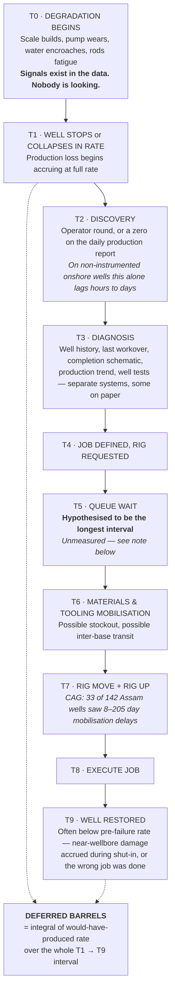

# Problem Statement
## Predictive Well-Stoppage Forecasting & Forward Workover Planning for ONGC Brownfield Assets

**Version:** 3.0 · **Date:** 2026-09-23
**Scope:** Problem definition only. No solution design, no architecture.
**Owner in the customer organisation:** Asset Manager / Executive Director of an Asset — e.g. ED Assam Asset.
**Companions:**
- `research_appendix.md` — derivations, corrections to the public record, rejected claims, full source index.
- `model_data_foundation.md` — what data to analyse for failure prediction, the public-data verdict, and the synthetic-data parameterisation. *Solution-adjacent; read after this document, not before.*

---

## 1. The problem

> **Wells do not just fail. They fail *as a surprise* — and surprise converts a schedulable maintenance event into an unschedulable emergency that competes for the scarcest resource on the asset: a workover rig.**

ONGC executes roughly **2,200 workovers and 13,000 stimulation jobs a year** — about six workovers every day — with a fixed rig fleet.

**How those rig-days are sequenced is not publicly documented, and this document does not assert it.** What *is* established, by the national auditor, is that the planning instrument governing them was found defective: CAG Report No. 42 of 2015 identified **"in-built inefficiency" in ONGC's Rig Requirement Plans** and attributed **₹6,418 crore of ₹7,995 crore in rig-management losses to factors controllable by ONGC**.

What does not exist — at ONGC, or at any operator worldwide — is a **forward, ranked, quantified 90-day intervention queue that an Asset Manager can defend in a monthly production review.** Experienced asset teams undoubtedly exercise judgement in sequencing. That judgement is not the gap. The gap is that it is **not systematised, not forward-looking, and not auditable**, and therefore cannot be optimised, defended, or improved year over year.

> [!IMPORTANT]
> **The first deliverable is to measure the gap, not to assume it.**
>
> No operator anywhere publishes what well unavailability costs an asset. India has no production-efficiency benchmark at all. That absence is not a weakness in this argument — **it is the argument**, and it is the first piece of work.

**The value is therefore not in knowing a well will die.** It is in converting the *discovery* of a well's death from an event into a forecast, so the same fleet can be sequenced by **deferred-barrel value**. Same rigs, same wells, same reservoir — more barrels.

**Success metric: deferred barrels avoided per rig-day deployed.** Not prediction accuracy.

---

## 2. Who owns it

The **Asset Manager / ED of an Asset** — a P&L and production-target owner, not a technical discipline. This deliberately does not map to a discipline persona.

| Dimension | Reality |
|---|---|
| **Primary KPI** | The asset's crude and gas production target, measured monthly, rolled up to the MoPNG MoU |
| **Controls** | A fixed workover rig fleet, a fixed well stock, an operating budget, a surveillance organisation |
| **Does not control** | Reservoir decline, crude price, the rig procurement cycle, the inherited well stock |
| **Lacks today** | A forward, ranked, quantified view of which wells will demand a rig in the next 30/60/90 days, and what each costs in barrels if it waits |

> A petrophysicist wants a **diagnosis**. An Asset Manager wants **a plan they can defend in a monthly production review**. The problem must be stated in production target, rig-days and deferred barrels — not pump diagnostics.

---

## 3. The asset base

### 3.1 Well population

| Quantity | Estimate | Confidence |
|---|---|---|
| ONGC **cumulative wells drilled**, all-time | **~18,000–25,000** (centre ~20,000) | Strong — two independent derivations converge |
| ONGC **producing** oil + gas wells | ~5,000–7,500 | Moderate |
| ONGC **non-flowing but connected** wells, onshore | ~2,000–3,700 | Weak — extrapolated from one atypical asset |

ONGC publishes no producing-well count; these are inferred (derivation in the appendix).

> [!WARNING]
> **"More than 10,000 wells" is correct for cumulative well stock, but wrong for producing wells.** An ONGC engineer will catch the distinction immediately. Use the cumulative framing, or say ~5,000–7,500 producers.

### 3.2 The base is unambiguously brownfield

| Field | On production since | Age in 2026 |
|---|---|---|
| Cambay | 1958 | ~68 yrs |
| Ankleshwar | 1961 | ~65 yrs |
| Lakwa / Rudrasagar (Assam) | 1960s | ~60 yrs |
| Geleki (Assam) | 1968 | ~58 yrs |
| **Mumbai High** | **May 1976** | **~50 yrs** |
| Gandhar | 1983 | ~43 yrs |

**ONGC's own maturity classification is the hardest evidence available:** in 2019 ONGC tendered **64 of its own fields that it classified as "marginal"** across 17 onshore contract areas under 15-year Production Enhancement Contracts; **49 were awarded to 7 bidders across 13 areas**. That is ONGC self-certifying 64 fields as mature enough to hand to third parties.

With Western Offshore at ~70% of ONGC crude, Mumbai High at ~25% of total output, and a mature-field recovery factor of **25–33%**:

> **The overwhelming majority of ONGC's production comes from fields more than 30 years old, at a recovery factor that leaves two-thirds of the oil in the ground. Well availability is what protects access to that remainder.**

### 3.3 One asset, concretely — Assam

| Metric | Value |
|---|---|
| Production installations | 43 |
| Drilling rigs | 16 |
| **Workover rigs** | **15** |
| Crude produced Apr 2025 – Jan 2026 | **875.83 thousand tonnes** |
| **Performance against target** | **10.66% BELOW** |

> [!IMPORTANT]
> The ED of Assam Asset is running **~10–11% behind the production target that defines their performance**. A shortfall of that size is not a reservoir mystery — well availability and intervention throughput are material contributors.

---

## 4. How the loss actually happens



**T5 is the only interval in this chain that is purely an allocation decision rather than a physical constraint.** T2 is instrumentation. T6 is supply chain. T7 and T8 are physics. **T5 is a choice** — and whether it is currently made with or without an explicit value function is not publicly documented.

> [!WARNING]
> **"T5 is the longest interval" is a hypothesis, not a finding. Do not state it as fact to a customer.**
>
> No operator anywhere — ONGC included — publishes average well-wait-to-intervention (`research_appendix.md` §5). The nearest public proxy is CAG 42/2015's finding of **8–205 day rig mobilisation delays on 33 of 142 Assam wells**, but that is inter-well rig-move lag (T7), **not** queue wait (T5).
>
> **This is a testable hypothesis and testing it is the first engagement deliverable.** The T1→T9 interval decomposition, measured once on one real asset, either confirms it or redirects the work to whichever interval actually dominates. Both outcomes are valuable; only one of them is currently assumed.

### Four distinct losses, not one

| # | Loss | Mechanism |
|---|---|---|
| **1** | **Primary deferred production** | Barrels not produced between failure (T1) and restoration (T9) |
| **2** | **Displacement loss** | An emergency pulls a rig off a planned job; the planned job's barrels are deferred too. **Almost never accounted for** — it appears as a schedule change, not a failure |
| **3** | **Wrong-job loss** | Time-pressured diagnosis on fragmented data treats the wrong mechanism. Rig-days spent, barrels do not return, well re-enters the queue |
| **4** | **Permanent recovery loss** | A well shut in long enough fails an economic revival test and is abandoned with oil behind pipe. **Deferred becomes permanent** |

> [!NOTE]
> **On the recovery argument — frame it as loss #4.** Say *"deferred becomes permanent"*, not *"continuous flow raises the recovery factor."* The first is bulletproof and quantified: the UK regulator reports **558 of 2,298 wells (24.3%) shut in at end-2025**, and **56 reinstated in 2025 delivered 16 mmboe** (~286 kboe/well). The second invites a reservoir engineer to argue with you.

---

## 5. The problem, stated precisely

**P1 · Detection is an event, not a forecast.**
Failure is discovered *after* it occurs. Degradation signals preceding most failure modes exist in the data but are not systematically surveilled across the well population. The asset learns at T2; the correct learning point is T0.

**P2 · The scarce resource is allocated without an explicit value function.**
The binding constraint is **workover rig-days**, not engineering knowledge. The operations research is unambiguous: the Workover Rig Scheduling Problem is **NP-complete**, and its objective minimises rig fleet cost **plus production loss from service delay**. *Optimising for rig utilisation alone is provably the wrong objective.* Two things follow, and only the second is a claim about ONGC: a problem of this size **cannot be solved optimally by unaided judgement at 2,200 jobs a year**; and there is **no published evidence that any operator, ONGC included, sequences its workover queue against a quantified deferred-barrel objective.** CAG's finding of *"in-built inefficiency" in the Rig Requirement Plans* is the closest direct evidence that the planning instrument is not doing this.

**P3 · Under-performing wells never enter the queue at all.**
Reactive management is triggered by *stoppage*. A gas-lift well injecting at the wrong valve depth, a rod pump at declining efficiency, a well with rising skin — these keep producing, so they never generate a work request. At a 25–33% recovery factor, this silent underperformance may exceed visible stoppage losses.

**P4 · The asset has no defensible forward plan.**
The Asset Manager cannot answer, in a monthly production review: *"Which wells will demand a rig in the next 90 days, what does each cost me in barrels if it waits, and is my rig and materials position adequate?"* Hence the last-minute scramble.

**P5 · The failure rate itself may be abnormally high.**
SPE-212848-PA reports **MTBF as low as 4–5 months** in ONGC western onshore rod-pumped wells, against an 18–36 month North American benchmark — implying ~2.4–3.0 workovers per SRP well per year.

> [!CAUTION]
> P5 describes **problem wells being studied**, not a fleet-wide average. State it as an upper bound on a subpopulation and it is unimpeachable. State it as "ONGC wells fail 4× more often" and it is not.

---

## 6. Why this is real and material

### 6.1 The four load-bearing facts

| # | Fact | Source |
|---|---|---|
| 1 | **2,110 (FY24) → 2,320 (FY26) workover jobs — against a plan of 2,304 — plus ~13,000 stimulation jobs per year.** That is **~6 workovers and ~35 stimulations every single day.** A high-frequency, industrial-scale, repeating allocation decision | ONGC results filings |
| 2 | **Petroleum PSU capex rose ₹1.3 lakh crore (FY2020-21) → ₹1.7 lakh crore (FY2024-25), +31%, while national crude fell 34.2 (FY2018-19) → 28.7 MMT (FY2024-25), −16%.** COPU found MoPNG's explanation "interim" and inadequate, and recommended performance benchmarks, periodic evaluation and stronger accountability | COPU 36th Report, Aug 2026 |
| 3 | **The UK regulator cut intervention cost £11.00 (2023) → £9.60 (2024) → £7.60/boe (2025) — −31% in two years — purely by re-prioritising *what* it intervened on**, toward restoring shut-in wells | NSTA, *2026 Wells Insights Report* |
| 4 | **ONGC has contractually conceded +44% oil and +89% gas upside at Mumbai High from existing infrastructure**, extended in June 2026 to all 43 Western Offshore blocks | ONGC/bp, Feb 2025 & Jun 2026 |

> [!IMPORTANT]
> **Fact 2 is the thesis in one line: capital is not the binding constraint. Money went up 31%; barrels went down 16%; and Parliament rejected the explanation.** The marginal rupee of capex is not the lever. How existing rig-days and existing wells are deployed is.
>
> **Fact 3 is the proof the mechanism works** — delivered by a regulator, not a vendor.
>
> **Fact 1 sets the improvement arithmetic:** at ~2,200 jobs a year, a 5% sequencing gain is worth **~110 job-equivalents of freed rig capacity annually**.

### 6.2 The auditor has already priced the failure

| Finding | Value | Source |
|---|---|---|
| Rig management losses FY2010-14 | **₹7,995 cr total, of which ₹6,418 cr CONTROLLABLE**; production deferment ≥ ₹5,117 cr; 19–23% **rig** non-productive time | CAG Report No. 42 of 2015 |
| Idle rig cost from untimely logistics and materials | **₹395.28 cr** | CAG, Marine Logistics audit |
| Western Offshore water injection FY2014-19 | **3.79 MMT crude lost, ₹11,276 cr** | CAG |
| Mumbai High gas flaring FY2012-20 | **₹816.08 cr**, from unavailable standby compressors | CAG, Dec 2021 |

**Two structural findings from CAG 42/2015 matter as much as the money:**

- The audit found **"in-built inefficiency" in ONGC's Rig Requirement Plans** — the planning instrument itself was defective, not merely its execution.
- ONGC operated with **no offshore rig acquisition policy at all between 2002 and 2015** — a thirteen-year gap in governing the deployment of its scarcest asset.

> **₹6,418 crore of ₹7,995 crore attributed to factors controllable by ONGC.** That is the national auditor establishing that ONGC's production gap is an **execution and allocation problem**, not a geology problem.

### 6.3 Energy-security consequence

| Metric | FY23 | FY24 | FY25 | FY26 |
|---|---|---|---|---|
| **Crude import dependency** | 87.4% | 87.7–87.8% | **88.2%** | **~88.7%** (record) |
| Domestic crude production (MMT) | 29.18 | 29.36 | 28.70 | ~28.0 |
| **Crude import bill (USD bn)** | 157.5 | 133.4 | 137.2 | 121.8 |

In March 2015 the Government targeted cutting dependency to **67% by 2022**. Actual: **87.4%** — a ~20 point miss. That dated, falsifiable target has been replaced by an undated "energy independence by 2047" aspiration with no interim milestone.

ONGC produces ~**65–70% of India's crude** and ~**84% of its gas**. Every barrel ONGC does not produce is a barrel India imports in hard currency.

---

## 7. What could defeat this — the counter-case

| Objection | Response | Verdict |
|---|---|---|
| **"The rig fleet is already saturated. Prediction just reorders the queue."** | Partly correct, and the strongest objection. Four mechanisms create *effective* capacity: **sequencing by value**; **campaign batching** (collapses rig-move time — CAG found 8–205 day mobilisation delays on 33 of 142 Assam wells); **pre-positioned materials** (CAG: ₹395 cr idle rig cost from logistics); and **rigless substitution** — hot oiling, annulus-circulated solvent and chemical squeezes, and surface work — which genuinely *expands* capacity by removing demand from the queue. ⚠ **Not slickline or CT: on a rod-pumped well the rod string blocks the tubing, so nothing on wireline reaches the wellbore** (`decision_architecture.md` §3.2a) | **Survives — but it defines the metric.** Deferred barrels avoided *per rig-day*, never prediction accuracy |
| **"Well failure is stochastic. You cannot predict it."** | Partly true; narrow the claim. **Good** predictability: rod pump wear, ESP degradation, scale, sand. **Moderate**: tubing leaks, gas-lift valve failure, water encroachment. **Poor**: sudden mechanical failure, casing collapse, power/monsoon events. Predictability also depends entirely on measurement frequency | **Survives, narrowed.** *A meaningful subset is forecastable with useful lead time; the remainder can still be **risk-ranked**. Risk ranking alone is sufficient to change rig sequencing* |
| **"ONGC already has NETRA, DARPAN, RTOC. Solved."** | Those are drilling-and-monitoring oriented. **Monitoring is not forward planning.** None is publicly documented as producing a ranked, economically-quantified forward workover queue. And ONGC's own SLB pilot at **Lakhmoni delivered ~10% uplift on artificial-lift wells** | **Strengthens the case.** Removes "will it work here?" risk; reframes as extending a proven internal pilot into the planning layer |
| **"Is the loss large enough to matter?"** | UKCS production efficiency sits at 75–77%, i.e. ~24% of potential undelivered — a regulator-measured, routinely-quantified loss pool | **Survives — with a mandatory caveat.** See below |
| **"The data won't be there."** | Much of ONGC's onshore stock is understood to be on manual well testing at daily-to-monthly cadence, not continuous telemetry. Oil India's DRIVE programme instrumented only 77 wells with 482 devices — instrumentation in Indian onshore is selective, not universal | **A precondition, not an objection.** See §9 — and it is the most serious practical risk |

> [!WARNING]
> **Handle this before a client raises it. NSTA attributes 83 of 114 mmboe of 2025 UKCS production losses — about 73% — to plant and facilities, not wells.**
>
> **Do not pitch "24% of production is lost and we fix it."** A technically literate client will correctly object that most of it is topsides. **Correct framing:** use the PE gap to establish that a large, regulator-measured loss pool exists, then pivot to well-specific numbers — shut-in stock, reinstatement economics, intervention cost/boe — for the addressable slice.
>
> There is a reasoned asymmetry in our favour: UKCS is offshore, facility-heavy and ESP/gas-lift dominated, whereas a mature onshore rod-pump field has a structurally higher well-related loss share. **State that as a reasoned expectation, not a cited number.**

---

## 8. Sizing — why there is no number here

> [!CAUTION]
> **This document deliberately contains no rupee estimate of the prize. Any such figure today would be assumption multiplied by assumption, and it is the first thing a hostile CFO would attack.**

### 8.1 What was removed, and why

An earlier version of this document sized one asset at **~₹65–130 crore/yr** by taking Assam's 10.66% shortfall and assuming **20–40% was attributable to well availability**. That 20–40% has no source. It was an assumption, and multiplying it by a derived $45/bbl marginal contribution — itself built on an undisclosed opex figure — produced a number with **two unsourced inputs presented to three significant figures.**

**It has been removed.** Quoting it would forfeit the credibility that the CAG and COPU facts in §6 earn.

### 8.2 The one frame that survives — and its hidden assumption

```
ONGC workover jobs per year                          ≈ 2,200        [SOURCED — ONGC filings]
A 5% improvement in sequencing / wait-time reduction ≈ 110 job-equivalents
                                                        of freed rig capacity per year
```

> [!WARNING]
> **The 5% is illustrative, not estimated. It has no source.**
>
> This frame was previously described as preferable because it "requires no assumption about deferred-barrel share." That was misleading: it simply **substitutes a different unsourced assumption** — that a 5% sequencing gain is achievable — and does not flag it. Swapping a labelled assumption for an unlabelled one is not de-risking.
>
> Use the 2,200 figure, which is sourced. Use the 5% **only** as a sensitivity illustration, stated as such out loud.

**What the frame is genuinely good for:** it is denominated in a unit ONGC already counts, and against which **ONGC already publishes a "work-over efficiency index"** (28.30 → 29.61). Improving a metric the customer already reports is a far easier sale than introducing a new one.

### 8.3 The only defensible benchmark is external

The **NSTA cut intervention cost from £11.00 to £7.60/boe in two years — a 31% improvement — purely by re-prioritising what it intervened on.** That is a real, regulator-published, achieved result from the mechanism proposed here. It is not an ONGC forecast and must never be presented as one, but it is the correct order-of-magnitude anchor and it is **someone else's audited number, not ours.**

**The honest statement of value:**

> *We do not know how large the prize is at any specific ONGC asset, because no one has measured it. What we know is that the loss mechanism is structurally present; that the national auditor has repeatedly found multi-thousand-crore controllable production losses; that capex rose 31% while production fell 16%; that ONGC has conceded a 44% oil upside on its flagship brownfield; that its own Lakhmoni pilot produced ~10% uplift; and that the UK regulator achieved a 31% intervention-cost improvement purely by re-prioritising the queue.* **The first deliverable of any engagement should be to measure the gap, not to assume it.**

---

## 9. Preconditions — what would have to be true

| # | Precondition | How to test | If it fails |
|---|---|---|---|
| **C1** | **Well-level production history at usable frequency** — daily rates or well tests at ≥ weekly cadence, ≥ 24 months, ≥ 80% of producers | Request a sample extract for one field | Fall back to risk-ranking on well attributes and event history rather than time-series forecasting |
| **C2** | **Well downtime and status history recorded** — start/end of every shut-in, with reason codes | Inspect the production database / daily production report | **Hardest blocker.** No baseline, no deferred-production computation, no way to prove value |
| **C3** | **Workover job history retrievable** — type, date, duration, well, outcome | Inspect the CMMS / workover records | Cannot learn failure signatures or estimate durations; scheduling degrades to capacity-only |
| **C4** | **Artificial lift telemetry on a meaningful subset** — ESP amps/temp/intake pressure, or dynamometer cards | Asset instrumentation survey | Predictive scope restricted to rate-decline mechanisms; excludes equipment failure prediction |
| **C5** | **The rig queue is actually a decision** — the asset has sequencing discretion | Interview the well services planner | Value collapses to diagnosis support only |
| **C6** | **Deferred production is or can be valued** | Interview the Asset Manager | The optimisation has no objective function |
| **C7** | **The "work-over efficiency index" definition is obtainable** | Ask ONGC; check investor filings | Lose the chance to improve a metric the customer already reports |

> [!WARNING]
> **C2 is make-or-break.** Without recorded well-downtime history with reason codes there is no baseline and no way to prove anything delivered has worked. **If C2 fails, the first project is a production-loss-accounting project, not a prediction project.**

---

## 10. The problem in one page

**Context.** ONGC produces ~65–70% of India's crude and ~84% of its gas from a well stock built over 70 years — plausibly ~20,000 wells drilled, ~5,000–7,500 currently producing — concentrated in fields 43 to 68 years old, at a recovery factor of 25–33%. India's import dependency has risen every year since the 2015 reduction target and stands at a record ~88.7%.

**Current operating model.** Interventions are triggered *after* a well stops. Diagnosis is assembled from fragmented systems. The well then joins a queue served by a fixed, scarce rig fleet — 15 rigs on the Assam Asset — and ONGC executes ~2,200 workovers and ~13,000 stimulations a year this way. **How that queue is sequenced is not publicly documented.** What the national auditor did establish is that the **Rig Requirement Plans themselves carried "in-built inefficiency"**, and that **₹6,418 crore of ₹7,995 crore in rig-management losses were controllable by ONGC.**

**Consequence.** Four compounding losses: primary deferred production; displacement when emergencies pre-empt planned jobs; wrong-job losses from time-pressured diagnosis; and permanent recovery loss when a well is written off with oil behind pipe. Meanwhile, wells that are merely *underperforming* never enter the queue at all.

**What is missing, and it is measurement before it is prediction:** no operator anywhere — ONGC included — publishes what well unavailability costs an asset, how long a well waits for a rig, or what share of production loss is well-related rather than facilities-related. India has no production-efficiency benchmark at all. **The gap has persisted precisely because it has never been measured.**

**The real problem, stated once:**

> **The Asset Manager owns a production target, and the principal lever available to defend it is the sequencing of a scarce workover rig fleet executing thousands of jobs a year — yet that sequencing rests on tacit judgement rather than a forward, ranked, quantified plan: no view of which wells will fail, when, or what each costs in barrels if it waits. The failure is not that wells die, and it is not that anyone is deciding badly. It is that their deaths are a surprise and the cost of waiting is unmeasured — and surprise forfeits the only degree of freedom the Asset Manager actually has.**

> [!NOTE]
> **Why this wording matters.** An earlier version stated that the fleet is *"dispatched reactively, by arrival order."* That is an unsourced claim about ONGC's internal practice, and an experienced Asset Manager can contradict it in one sentence — *"we hold a monthly well services meeting; I know which of my wells matter"* — at which point every sourced figure in this document becomes suspect by association.
>
> The claim above concedes that judgement is exercised and competently so. It asserts only that the judgement is **not systematised, not forward-looking, and not measured.** That is defensible, it is very likely true, and the Asset Manager's own experience **confirms rather than refutes it.**

**The falsifiable success metric:** deferred barrels avoided per rig-day deployed.

---

## 11. Principal sources

| Source | Used for |
|---|---|
| **CAG of India, Report No. 42 of 2015** — Rig Management performance audit (FY2010-11 to FY2013-14) | ₹7,995 cr total / ₹6,418 cr controllable idling; 19–23% **rig** NPT; ≥₹5,117 cr production deferment; 33 of 142 Assam wells with 8–205 day mobilisation delays; "in-built inefficiency" in Rig Requirement Plans; no offshore rig acquisition policy 2002–2015 |
| **CAG of India** — Western Offshore water injection (FY2014-19); Mumbai High flaring (FY2012-20); Marine Logistics (2019) | 3.79 MMT crude lost / ₹11,276 cr; ₹816.08 cr flared from unavailable standby compressors; ₹395.28 cr idle rig cost from untimely logistics |
| **COPU 36th Report**, presented August 2026 | Crude 34.2 (FY19) → 28.7 MMT (FY25); PSU capex ₹1.3 (FY21) → ₹1.7 lakh crore (FY25); MoPNG reply found "interim" and inadequate; recommended benchmarks, periodic evaluation, accountability |
| **NSTA**, *UKCS Production Efficiency in 2025* (published 6 Aug 2026) | PE 77% / 75% / 76% (2023/24/25); **114 mmboe total losses 2025, of which 83 mmboe (73%) plant & facilities** |
| **NSTA**, *2026 Wells Insights Report* (August 2026) | Well stock end-2025: 2,298 total (1,439 operating / 558 shut-in / 301 plugged); **398 interventions in 2025**; cost/boe added £11.00 → £9.60 → £7.60; 56 reinstatements → 16 mmboe |
| **ONGC Integrated Annual Report FY2024-25** + exchange filings | 18.558 MMT crude (+0.9%); 19.654 BCM gas (−1.6%); **578 wells drilled**; 2,110 workovers FY24 / 2,320 FY26 (vs plan 2,304); 13,276 / 12,963 stimulation jobs; work-over efficiency index 28.30 → 29.61 |
| **ONGC / bp**, Feb 2025 and Jun 2026 | +44% oil / +89% gas Mumbai High targets; extension to all 43 Western Offshore blocks |
| **PPAC**, *Snapshot of India's Oil & Gas Data* / Monthly Ready Reckoner | Import dependency, domestic production and import bill series |
| **DGH National Data Repository** | ~24,000 wells, all India, all operators, since 1889 |
| **Aloise, Aloise, Rocha, Ribeiro, Ribeiro Filho & Moura (2006)**, "Scheduling workover rigs for onshore oil production," *Discrete Applied Mathematics* 154(5):695–702, **DOI 10.1016/j.dam.2004.09.021** | Canonical Workover Rig Scheduling Problem; **NP-complete**; objective = rig fleet cost + production loss from service delay; validated on real Petrobras onshore instances |
| **Kumar, Upadhyay & Kumar (2023)**, "Tubing and Rod Failure Analysis in Rod Pumped Wells in an Indian Western Oil Field," **SPE-212848-PA**, *SPE Journal* Vol. 28 Iss. 3, June 2023 | 4–5 month SRP MTBF in ONGC western onshore; mechanisms = lateral loads in deviated wells, rod and tubing buckling below the neutral point; remedy = rod guide placement below the neutral point |
| **Abdelkerim, Alseedi & Al-Radhi (2025)**, "Application of AI Foresight Model in ADNOC Offshore for Preventing Premature ESP Failure and Extending Overall Run Life," **SPE-224462-MS**, GOTECH, 21–23 April 2025 | Hybrid ML + physics + digital twin for ESP remaining useful life; benefit framed as optimised rig allocation and inventory |
| **ISO 14224** / Standards Norway | MTTF vs MTBF counting conventions; why cross-operator reliability comparison is unreliable |
| **ONGC PEC tender and award records (2019)** | 64 fields self-classified marginal across 17 contract areas; 49 awarded to 7 bidders across 13 areas |
| **ONGC Assam Asset operational summaries**; PPAC / trade reporting | 43 production installations, 16 drilling rigs, 15 workover rigs; 875.83 kT Apr'25–Jan'26, 10.66% below target |
| **ONGC / SLB pilot material** | Lakhmoni digital oilfield, ~10% uplift on artificial-lift wells |
| **ONGC IOR/EOR disclosures, PIB** | Mature-field recovery factor 25–33% |
| **SKK Migas / ESDM / Pertamina** | Indonesia idle-well analogue; Permen ESDM 14/2025 |
| *The New Indian Express*, March 2018 (ONGC-supplied figures) | Tamil Nadu census: 712 drilled / 380 dry / 304 connected / 181 flowing / 28 utility |

> [!NOTE]
> Derivations, corrections to widely-circulated false figures, explicitly rejected claims, known data gaps and outstanding research items are held separately in `research_appendix.md`. **Read it before quoting any number from this document to a customer.**
