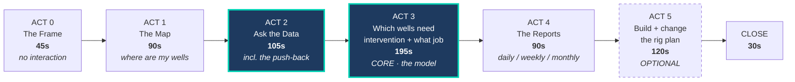

# Demo Flow
## Gemini Enterprise — Agentic Workover Planning for ONGC Assam Asset
### 10-Minute Live Boardroom Demonstration

**Status:** Demo design **v2.0** — *restructured to the four-act flow: map → ask the data → intervention list → reports*
**Date:** 2026-09-23
**Companion documents:** [decision_architecture.md](./decision_architecture.md) v1.1 — *the product spec; Acts 3–4 are derived from it* · [Problem Statement.md](./Problem%20Statement.md) · [model_data_foundation.md](./model_data_foundation.md) · [build_plan.md](./build_plan.md) — *how it gets built*
**Duration:** ~10 minutes, 4 core acts + 1 optional
**Audience:** ONGC leadership — Basin Manager / Asset ED / Director level, with technical staff present
**Protagonist in the story:** The Executive Director, Assam Asset

---

## 0. What changed in v2.0 — read this first

The demo is now built around **four acts that map one-to-one onto how the ED will describe it afterwards.**

| Act | In one sentence |
|---|---|
| **1** | *"It showed me my wells on a map."* |
| **2** | *"I asked it questions about the data and it answered — and it corrected me once."* |
| **3** | *"It told me which wells will fail, when, and what job each one needs."* |
| **4** | *"And it produces that as a report every day, week and month."* |

**Three structural changes from v1.2:**

| # | Change | Why |
|---|---|---|
| **1** | **Prediction is back in the core act.** v1.2 demoted the survival model to an optional 30-second closer to avoid the circularity challenge. That was over-correction — it removed the moment the ED came for | An ED will not audit the training set. They will ask *"can you tell me which wells will fail?"* The demo must say yes |
| **2** | **The reports are now an act, not a footnote.** Daily / weekly / monthly, with the monthly scorecard aimed at the Basin Manager | This is what converts a capability demo into an operating rhythm. It is also the cheapest thing to build — three queries over the nightly run |
| **3** | **The push-back merged into Act 2.** It belongs with the data questions, not as a standalone beat | Tightens the flow and keeps the strongest beat early, while attention is highest |

> [!IMPORTANT]
> **The circularity defence has not been dropped — it has been relocated.** It is now a prepared answer at the end of Act 3 rather than a structural retreat. The trigger logic still does most of the work, which is precisely what makes the honest answer safe to give. See Act 3.

**Two additions that cost almost nothing:**

- **A provenance moment.** When the agent explains *why* a well is a candidate, it cites a scanned 2019 workover report PDF. That single citation proves "access data from anywhere" more convincingly than any architecture slide.
- **A visible synthetic-data banner.** Say it out loud and show it on screen. See §6.

> [!NOTE]
> **Spelling matters in the first thirty seconds.** It is **Geleki** — a real ONGC Assam Asset field, **discovered 1968, on production from c.1974**, managed from Nazira/Sivasagar alongside Lakwa, Rudrasagar, Lakhmani, Laiplingaon, Demualgaon, Charali and Changmaigaon. Using the real field name and its real neighbours signals you did the homework.

---

## 1. The narrative frame — state this before touching the keyboard

> *"It is Monday morning. You are the Executive Director of Assam Asset. Your production is running about ten percent behind target. You have fifteen workover rigs and several hundred producing wells across eight fields. Your only real lever this month is deciding where those fifteen rigs go.*
>
> *Today that decision gets made from spreadsheets, after wells have already stopped. Let me show you how it could be made before they stop."*

**Everything that follows answers one question: where do the fifteen rigs go?**

**The positioning line, in ONGC's own vocabulary — use this wording:** *"An agentic WRFM execution layer for Assam Asset that converts each rig-day into decline-arrest barrels."* **WRFM** is Well, Reservoir and Facility Management; it is their term, not ours, and using it places this inside an existing discipline rather than alongside it.

Do not describe Gemini Enterprise. Do not say "agent" in the first two minutes. Let the capability be inferred from the work.

---

## 2. The flow at a glance



**Budget:** 45 + 90 + 105 + 195 + 90 + 120 + 30 = **675s (11.25 min)**.
**Cut Act 5 → 555s (9.25 min).** Rehearse with Act 5 in; drop it if Act 3 runs long, which it will.

| Act | The ED sees | Needs a trained model? |
|---|---|---|
| **1** The map | Real Assam geography, wells colour-coded by status | ❌ |
| **2** Ask the data | Production plots on demand, and a system that corrects a bad question | ❌ |
| **3** Intervention list | Ranked wells · **predicted failure dates** · diagnosis · job type · draft plan | ✅ **yes — this is the model beat** |
| **4** Reports | Daily queue → weekly rig plan → monthly ED scorecard | ❌ aggregation only |
| **5** The rig plan | Constrained schedule, and replanning on request | ❌ |

> [!IMPORTANT]
> **Act 3 is the only beat that needs the survival model, and it is the beat the whole demo exists for.** Everything around it is defensible arithmetic. That matters when the question comes — see the circularity defence at the end of Act 3.

---

## 3. The four acts — verbatim prompts and expected behaviour

### ACT 0 · The Frame — 45s, no interaction

One slide. Four numbers, nothing else on it:

| | |
|---|---|
| Assam Asset production, Apr'25–Jan'26 | **875.83 thousand tonnes** |
| Performance against target | **10.66% below** |
| Workover rigs available | **15** |
| ONGC workovers executed per year | **~2,320** |

Deliver the narrative frame from §1. Do not read the slide aloud.

---

### ACT 1 · The Map — "Where are my wells?" — 90s

> **PROMPT (type it live):**
> *"Show me all producing wells in the Geleki field on a map, sized by current oil rate and coloured by well status."*

**Expected response:** a map rendered natively in the Gemini Enterprise card — real Assam geography, field outline, well points positioned on actual coordinates, size by rate, colour by status, tooltips on hover. Plus a one-line summary:

> *"142 wells in Geleki: 96 flowing, 19 intermittent, 27 shut-in. Current oil rate 2,840 BOPD."*

**Colour coding — fix this now, it is referenced by every later act:**

| Colour | Status | Approx. count |
|---|---|---|
| 🟢 Green | Flowing, within expected decline | 78 |
| 🟡 Amber | Flowing but **below its own decline curve** | 18 |
| 🔴 Red | **Flagged for intervention** | 19 |
| ⚫ Grey | Shut-in / idle | 27 |

**Say while it renders:**
> *"No export. No BI request. No ticket to IT. This is your production database, answered in plain English, and the visualisation is generated on the fly — nobody built this dashboard in advance."*

**Proves:** data access · real geospatial rendering · GE-native visualisation

> [!TIP]
> **Make the red and grey wells visually loud.** When the room sees 19 red and 27 grey dots among the live ones, someone will ask about them unprompted. That question is a gift — it is the setup for Act 3. If nobody asks, point at them and say *"hold that thought."*

> [!WARNING]
> **The map is the highest technical risk in the demo and it is the first thing on screen.** See §5.4 — confirm the renderer supports `geoshape` with a projection **before** building anything else. If it does not, fall back to a pre-rendered basemap image with plotted points.

---

### ACT 2 · Ask the Data — 105s · **CREDIBILITY BEAT**

Two prompts. The second one is the point.

**2a — plot a single well, 30s**

> **PROMPT:**
> *"Plot the oil, water and liquid production for GK-129 over the last three years, and show its water cut."*

**Expected response:** a dual-axis chart — oil and water rate stacked or overlaid on the left axis, water cut on the right. Visible in it: water cut climbing from ~62% to ~78% in a narrow window, and oil rate falling away from a smooth curve.

**Say:**
> *"Ordinary question, ordinary answer. Hold on to that water cut line — we come back to it."*

**2b — the push-back, 75s**

> **PROMPT:**
> *"Which are my lowest producing wells in Geleki?"*

**Expected response — two parts:**

*Part 1, the literal answer:* a ranked table of the five lowest-rate producers.

*Part 2, unprompted:*
> *"However — ranking by absolute rate will mislead you here. Three of these five (GK-044, GK-071, GK-098) are mature wells producing close to their expected rate for this stage of decline. There is little to recover.*
>
> *These wells are the better candidates — each is producing materially below what **its own** decline curve predicts:*

| Well | Actual (BOPD) | Expected from its own decline | Gap | Gap % |
|---|---|---|---|---|
| GK-112 | 14 | 38 | **−24** | −63% |
| GK-087 | 22 | 46 | **−24** | −52% |
| GK-129 | 9 | 27 | **−18** | −67% |

*Plus a chart showing one well's actual-vs-fitted decline with the divergence shaded.*

**Say — slowly, this is the moment:**
> *"I want to draw your attention to what just happened. I asked a bad question, and it told me so. A system that only translates English into SQL would have answered the question I asked. This one answered the question I meant. That difference is the entire distance between a chatbot and something you would let near a rig schedule."*

**Proves:** ad-hoc charting · domain reasoning · deterministic decline-curve fitting · willingness to disagree with the user

> [!IMPORTANT]
> **Rehearse this beat more than any other.** It is the one the room will repeat to colleagues who were not there. If the push-back does not fire reliably, **hard-code it** — this behaviour is too important to leave to sampling.

---

### ACT 3 · Which wells need intervention — 195s · **CORE**

This is the act the ED came for. It answers three questions in sequence: **which wells, when will they fail, and what job do they need.**

> **PROMPT:**
> *"Which Geleki wells need intervention, when is each one likely to fail, and what job does each need?"*

**Show the tool calls.** The room must see that the arithmetic is not the language model's opinion:

```
▸ fit_decline_curve()       Arps hyperbolic, 142 wells, 36 months      ✓ 1.8s
▸ trigger_scan()            A: below own decline · B: due on own
                             run-life · C: diagnostic signature         ✓ 1.1s
▸ chan_diagnostic()         WOR / WOR′ log-log, water mechanism ID     ✓ 0.9s
▸ fillage_proxy()           theoretical displacement vs actual liquid  ✓ 0.4s
▸ check_offsets()           neighbouring wells — reservoir or well?    ✓ 0.7s
▸ predict_failure()         random survival forest, hazard + ETTF      ✓ 2.1s
▸ route_intervention()      mechanism → job, rig vs rigless            ✓ 0.3s
▸ search_well_history()     47 workover reports, 1998–2024 (GCS)       ✓ 3.4s
▸ estimate_uplift()         skin-based nodal, post-intervention rate   ✓ 1.2s
```

**The table — this is the screen the ED photographs:**

| # | Well | Why flagged | **Expected failure** | Conf. | Diagnosis | **Intervention** | Rig? |
|---|---|---|---|---|---|---|---|
| 1 | **GK-112** | A · 38% below own decline, 9 d | **~18 Oct** (±11 d) | High | Scale in tubing | **Acid treatment, bullheaded** | **No** |
| 2 | **GK-129** | A + C · 31% below · WOR′ +1.08 | **~02 Nov** (±14 d) | High | Channelling behind casing | **Cement squeeze + reperf** | Yes · 7 d |
| 3 | **GK-087** | B · 6.4 mo vs own p50 of 5.9 | **~09 Nov** (±21 d) | Med | Fluid pound → rod fatigue | **Rod string + guides** | Yes · 2 d |
| 4 | **GK-055** | C · fillage divergence, CHP rising | **~21 Nov** (±19 d) | Med | Pump wear | **Pump changeout** | Yes · 2 d — pulling unit |
| 5 | **GK-103** | C · WOR′ negative slope | — *no failure predicted* | High | Bottom-water **coning** | **Choke back** | **No** |
| 6 | **GK-147** | C · THP rising, seasonal pattern | **~28 Oct** (±9 d) | High | Paraffin / wax | **Hot oil + solvent soak** | **No** |
| — | **GK-141** | A · 22% below own decline | **—** | — | **Offsets down too → reservoir** | **NO JOB JUSTIFIED** | — |

**Say:**
> *"Six wells, six different problems, six different jobs. Three need a rig. Three do not — and those three can run this week without touching your rig schedule at all."*

> [!CAUTION]
> **Do not describe any of the rigless three as slickline or coiled tubing.** On a rod-pumped well the rod string occupies the tubing, so nothing on wireline or CT can reach the wellbore. The three rigless jobs here are **bullheaded acid, a surface choke adjustment, and annulus-circulated hot oil** — all genuinely rigless, none of them requiring anything to go down the hole past the rods. This is `TC-008.6`, and an ONGC production engineer will test it.

> [!TIP]
> **GK-141 is the most important row on the screen. Point at it deliberately.**
>
> *"This one is producing 22% below its curve — but so are its neighbours. That is a reservoir or injection issue, and no workover will fix it. The system is telling you **not** to send a rig."*
>
> **A system that always recommends a job is a system nobody believes.** This row is what makes the other six credible.

> [!NOTE]
> **GK-103 is the second-cleverest row.** Coning and channelling both look like "rising water cut." Chan's WOR′ slope separates them — **negative means coning, positive means channelling** — and they need opposite responses. GK-103 gets a free choke adjustment. GK-129 gets a seven-day rig job. Get that backwards and you spend a week of rig time on a well that needed thirty minutes.

**Then drill into ONE well and show the draft plan:**

> **PROMPT:**
> *"Build me the plan for GK-129. Why channelling rather than coning?"*

```
DRAFT INTERVENTION PLAN — GK-129 · Geleki        AWAITING REVIEW

WHY THIS WELL, NOW
  Trigger A   31% below its own fitted decline, 12 consecutive days
  Trigger C   WOR′ slope +1.08 → channelling signature
  Predicted   failure ~02 Nov ± 14 d · 41 days of lead time

DIAGNOSIS                                          confidence HIGH
  Water channelling behind casing, 1,847–1,862 m
  · water cut 62% → 78% in 11 days — too fast for coning
  · WOR′ log-log slope +1.08 over 90 d → channelling, not coning
  · offsets GK-127, GK-131 stable → well-specific, not reservoir
  · [cite] Completion Report 1998-03: poor cement bond, 1,845–1,865 m
  · [cite] Workover Report 2019-11: water shutoff, lasted 14 months
  Rejected: coning — WOR′ slope is positive, coning requires negative

RECOMMENDED    Cement squeeze + reperforation · rig · 7 d ± 2
               P(success) 0.61 — 11 of 18 comparable jobs, Geleki 2019–25
  Alternative  Straddle packer — cheaper, 3 d. NOT recommended:
               2019 attempt on this same well failed at 14 months

VALUE          18 BOPD now → 24 BOPD · ~2,900 bbl avoided over 12 mo
LOGISTICS      ⚠ 5½" retainer NOT at Nazira — Sivasagar, +2 d transit
               Rig WO-7 free 10-04 · earliest start 10-06 · displaces nothing
PRECONDITION   ☐ Cement bond log first — 2019 failure unexplained without it

        [ APPROVE ]  [ MODIFY ]  [ REJECT — reason ]  [ DEFER ]
```

**Say — this is the line the whole demo exists for:**
> *"That is not an alert. That is a plan. It names the job, prices it, tells you it has been tried before on this well and how that went, flags that the retainer is in the wrong warehouse, and tells you the one thing to do before you start. Your engineer's judgement is still the decision — the assembly is what he doesn't have time for."*

**And on the citation:**
> *"Look where that 2019 evidence came from. A scanned workover report nobody indexed for this purpose. It found it, read it, and used it to argue **against** its own cheaper recommendation."*

**Proves:** survival model with lead time · deterministic physics (Arps, Chan, fillage) · mechanism→job routing · the restraint to recommend nothing · unstructured retrieval with citation · rigless substitution · **a draft a human can approve**

> [!CAUTION]
> **The circularity question — prepare for this, it is the one that can hurt.**
>
> Someone technical will ask: *"What was the model trained on?"* The honest answer is synthetic Assam data. Do not dodge it. Answer:
>
> > *"Synthetic, and I will tell you exactly how it was generated — the failure mechanisms, the rates and the taxonomy are all from published sources and I can show you the parameters. But here is the more useful answer: **four of the six wells on that screen were flagged without the model at all.** GK-112 is below its own decline curve. GK-087 is past its own run-life. GK-103 and GK-147 have physics signatures you can compute by hand. The model adds the date and the lead time. Take it away and you still have the list."*
>
> **That is why the trigger logic exists.** It is not a fallback — it is the load-bearing wall that lets you be completely honest about the model.

---

### ACT 4 · The Reports — 90s

> [!IMPORTANT]
> **This is the beat that converts a demo into a purchase.** Everything before it is a capability. This is an **operating rhythm** — something that arrives every morning whether or not anyone logs in. Full specification in [decision_architecture.md §6](./decision_architecture.md).

> **PROMPT:**
> *"Generate today's intervention report, and show me what the weekly and monthly versions look like."*

**Three artefacts, three audiences. Flip through them quickly — 30 seconds each.**

**Daily → the Asset Manager's queue.** *What changed overnight and what needs a signature today.*

```
DAILY INTERVENTION BRIEF — Geleki · 23 Sep 2026 · 06:00

NEW OVERNIGHT                3 wells
  GK-112  trigger A fired  ·  38% below own decline, day 9  ·  DRAFT READY
  GK-147  trigger C fired  ·  THP +14% over 6 d, wax        ·  DRAFT READY
  GK-088  trigger B fired  ·  run-life p50 exceeded         ·  DRAFT READY

AWAITING YOUR REVIEW         7 drafts   (2 rig · 5 rigless)
MOVED UP THE RANKING         GK-129  #5 → #2  (water cut +4 pts in 48 h)
BLOCKER CLEARED              GK-177  5½" retainer arrived Nazira — schedulable
```

**Weekly → the rig plan.** *What the rig is doing for 14 days, and what is slipping.*

```
WEEKLY INTERVENTION PLAN — Geleki · week of 05 Oct 2026

RIG-REQUIRING                              WO-7        WO-3
  Mon 05   GK-129  cement squeeze + reperf  ████████
  Thu 08   GK-204  pump changeout                      ████
  Fri 09   GK-118  rod string repair                   ██████
  committed 14 of 14 rig-days               ⚠ no slack

RIGLESS — parallel, no rig contention                    9 jobs
  hot oil / scraper     GK-133, GK-147, GK-151, GK-162
  scale squeeze (CT)    GK-109, GK-188
  choke adjustment      GK-171, GK-193
  surface / prime mover GK-206

SLIPPING
  GK-141  deferred — offsets confirm reservoir decline, no job justified
  GK-177  blocked  — retainer transit, ETA 11 Oct
```

**Say:**
> *"Nine jobs cleared this week without a rig. Today those nine are invisible — they are not on anyone's intervention list, so they queue behind work that does not actually block them."*

**Monthly → the ED scorecard.** *This one is for you.*

```
MONTHLY INTERVENTION REVIEW — Geleki · September 2026

THROUGHPUT            this month   3-mo avg
  Jobs completed              23         19   ▲
    rig-requiring             16         15
    rigless                    7          4   ▲
  Rig-days consumed           61         68   ▼
  Days flagged → executed   11.4       18.2   ▼

OUTCOME
  Deferred bbl avoided     ~4,800
  Uplift vs predicted         +7%   (18 of 23 within ±20%)

WHERE THE SYSTEM WAS WRONG                    ⚠
  False positives     4   flagged, engineer rejected, well was fine
      3 × choke change not in the data feed → FIX: ingest choke log
      1 × genuine model error
  Missed failures     2   failed with no prior flag
      GK-162  rod part, no precursor — expected, 5% of failures
      GK-118  precursor present 9 d prior, threshold too loose → retuned

ENGINEER OVERRIDES   rejected 6 · modified 9
  most common: "combine with adjacent well, save a rig move"
  → not currently in the value function. Candidate change.
```

**Say — point at the "where the system was wrong" block:**
> *"That section is deliberate. Four times last month it flagged a well that was fine, and three of those were because a choke change never reached the data feed. Not a model problem — a plumbing problem, and now a named fix.*
>
> *A system that only reports its wins gets read once. This one tells you where it is weak, which is the only reason to believe the rest of the page."*

**Proves:** scheduled autonomous operation · aggregation across three horizons · **self-assessment** · the feedback loop that improves the model

> [!NOTE]
> **Every rejection is a labelled training example.** After 200 of them ONGC owns something it cannot buy — a machine-readable record of how its best engineers actually reason. Say this if the room is engaged; cut it if you are behind.

---

### ACT 5 · Build and change the rig plan — 120s · **OPTIONAL**

Cut this if Act 3 ran long. The demo is complete without it.

> **PROMPT:**
> *"Build next month's workover plan for Geleki and Lakwa using the 15 available rigs. Rank by deferred barrels avoided, check materials, and separate anything that can be done rigless."*

```
ASSAM ASSET · WORKOVER PLAN · OCTOBER 2026          [ DRAFT — AWAITING APPROVAL ]

RIG CAMPAIGN                  12 jobs · 11 rigs · 218 rig-days
  Geleki cluster   7 jobs   ← batched: one mobilisation, saves 9 rig-move days
  Lakwa cluster    5 jobs
RIGLESS CAMPAIGN               9 jobs · hot oil, squeeze, surface · 0 rig-days
MATERIALS                    ✓ 19 of 21 kits at Nazira
                             ⚠ GK-129 — 7" packer out of stock, Sivasagar +2 d
DEFERRED TO NOVEMBER           4 candidates · 31 BOPD at risk · rig capacity
──────────────────────────────────────────────────────────────────────────────
DEFERRED BARRELS AVOIDED     ~38,600 bbl / 12 mo    RIG-DAYS  218 of 465
──────────────────────────────────────────────────────────────────────────────
                    [ APPROVE ]   [ MODIFY ]   [ REJECT ]
```

**Then change it:**

> **PROMPT:**
> *"Add GK-114 to October — the field manager wants it done. What falls off?"*

> *"GK-114 added, 16 rig-days. To stay within 15 rigs, LW-061 moves to November. Trade-off: you gain 9 BOPD from GK-114 and defer 14 BOPD from LW-061 — a net loss of about 1,800 barrels over twelve months. Recommend instead deferring GK-055, which is rigless and can run in parallel without consuming a rig."*

**Say:**
> *"That is the difference between a report and an instrument. You can argue with it, and it will tell you what your decision costs."*

**Proves:** constrained optimisation · MRO integration · campaign batching · interactive replanning · human-in-the-loop gate

---

### CLOSE · 30s

No slide. Say it:

> *"Fifteen rigs. Same fifteen you have today. No new wells, no new capital, no new reservoir.*
>
> *What changed is that every well that needs attention was found the same night, the reason was diagnosed, the job was named and priced, the materials were checked, and a plan was on the Asset Manager's desk before anyone asked for it — and a report telling you how well that worked arrives on the first of every month.*
>
> *ONGC runs roughly two thousand three hundred workovers a year. The UK regulator cut intervention cost by thirty-one percent in two years — purely by changing what it intervened on, not how much it spent.*
>
> *We do not know what the number is here, because nobody has measured it. That is the first thing we would do."*

Stop. Do not add anything.

---

## 4. Capability-to-act coverage matrix

| Capability | Act 1 | Act 2 | Act 3 | Act 4 | Act 5 |
|---|:---:|:---:|:---:|:---:|:---:|
| **1. Access data from anywhere** | ● structured | ● | ●● **scanned PDF + citation** | ● | ● MRO / inventory |
| **2. Display wells on a map** | ●● | | ● | ● | ● |
| **3. Aggregate + chart in the GE UI** | ● | ●● production + decline | ●● Chan plot | ● trend charts | |
| **4. Deterministic workflows + ML** | | ● Arps fit | ●● **full chain + survival model** | ● | ●● optimiser |
| **5. Generate plan + priority** | | | ●● draft plan | ●● **scheduled reports** | ●● |

●● = primary demonstration · ● = supporting

**Every capability lands at least twice.** Capability 1 is the weakest on screen and the strongest in claim — which is why the Act 3 PDF citation carries so much load. **Do not cut it.**

---

## 5. What to build — technical specification

### 5.1 Data sources to stand up

Three distinct tiers, because the "data from anywhere" claim requires visibly different sources.

| Tier | Source | Contents | Why it must be separate |
|---|---|---|---|
| **Structured** | BigQuery | `well_master`, `daily_production` (36 months), `well_tests`, `well_status_history` — **full schema below** | The map, the aggregation, the decline fits |
| **Unstructured** | GCS + Vertex AI Search | 40–50 synthetic workover reports and well completion reports as **scanned-looking PDFs**, 1998–2024 | The Act 3 citation. **This is the differentiator — do not substitute clean text files** |
| **Operational** | Cloud SQL or JSON | MRO inventory by base (Nazira, Sivasagar), rig availability calendar, job cost and duration norms | The Act 5 stock-out and the capacity constraint |

**Structured schema — fields marked ⚠ were added in v1.1 and are non-optional:**

| Table | Fields |
|---|---|
| `well_master` | ID, field, lat/lon, completion date, lift type, TVD, MD, deviation/DLS, **⚠ plunger diameter**, **⚠ stroke length**, **⚠ pump setting depth**, **⚠ rod string grade** |
| `daily_production` | oil / water / gas rate, THP, choke, **⚠ casing head pressure (CHP)**, **⚠ strokes per minute (SPM)**, **⚠ runtime hours** |
| `well_tests` | periodic — every 14–30 days, **never daily**; daily values are allocated, not measured |
| `well_status_history` | shut-in start/end, **⚠ reason code from the 9-code taxonomy**, **⚠ rigless flag** |

> [!CAUTION]
> **The ⚠ fields are not nice-to-haves.** The top-ranked mechanical feature is the **pump fillage proxy** = `0.1166 × Ap × S × N × runtime_fraction − actual_liquid_rate`. Without plunger diameter, stroke length, SPM and runtime it **cannot be computed at all**, and the model falls back to rate-trend features alone. See [model_data_foundation.md §1.1](./model_data_foundation.md).

> [!IMPORTANT]
> **`well_status_history` with reason codes is the table everything depends on.** It is also precondition **C2** in the Problem Statement — the one flagged as make-or-break. Building the demo on it is deliberate: it lets you say to ONGC, *"the one thing we would need from you is this table,"* and they will already have seen why.
>
> The **rigless flag** is new in v1.1 and earns its place: **24% of failures need no rig at all**, which is a direct, quantified answer to the "the fleet is already saturated" objection.

### 5.2 Deterministic tools the agent must call

Keep these strictly separate from the language model. The Pitch Bible position is zero LLM arithmetic, and the tool-call trace in Act 3 is how you prove it visually.

| Tool | Method | Used in |
|---|---|---|
| `fit_decline_curve()` | Arps hyperbolic, `q(t) = qᵢ / (1 + b·Dᵢ·t)^(1/b)`, least-squares. `b = 0.5–1.0` for mature waterflood | Act 2, 3 |
| `trigger_scan()` | **A** residual vs the well's **own** fitted decline (−15% watch / −25% flag / −40% urgent, sustained 7+ producing days, no choke change) · **B** `days_since_intervention > p50 of this well's own prior run-lives`, throughput-weighted · **C** diagnostic signature fires | Act 3 |
| `chan_diagnostic()` | WOR and WOR′ on log-log; slope classification. **Negative → coning · positive → channelling · plateau → multilayer.** Do not invert this | Act 3 |
| `fillage_proxy()` | `0.1166 × Ap(in²) × S(in) × N(spm) × runtime_fraction − actual_liquid_rate`. Fluid-pound detection | Act 3 |
| `check_offsets()` | Compares the well's decline residual against its geometric neighbours. **If offsets are down too it is reservoir, not wellbore** — this is what produces the NO JOB JUSTIFIED row | Act 3 |
| `predict_failure()` | **Survival model, not a binary classifier.** Random Survival Forest / Cox PH returning **expected time-to-failure + hazard + confidence interval**, right-censored. Features: pump fillage proxy, WOR and WOR′, decline residual, runtime fraction, CHP drift, days since last intervention, prior run-life, prior failure type and count, well age, pump setting depth | Act 3 |
| `route_intervention()` | Maps diagnosed mechanism → job via the **28-row catalogue** in [decision_architecture.md §3.1](./decision_architecture.md). Returns job, rig vs rigless, duration. **24% of jobs exit the rig queue here** | Act 3, 5 |
| `search_well_history()` | Vertex AI Search over scanned workover and completion PDFs. Must return a **citation with document and date** | Act 3 |
| `estimate_uplift()` | Skin-reduction nodal estimate, IPR vs VLP | Act 3, 5 |
| `rank_candidates()` | `PRIORITY = net_value ÷ rig_days`. Deferred barrels avoided over 12 months × P(success), less job cost. **Consumes the hazard ranking, not a binary flag** | Act 3, 5 |
| `generate_report()` | **NEW v2.0.** Aggregates the nightly run into a daily, weekly or monthly view. **Must not recompute anything** — it reads the same table the drafts came from. Monthly additionally joins post-job actuals and the rejection log | Act 4 |
| `schedule_rigs()` | Workover Rig Scheduling Problem. Objective = rig cost **+ deferred production** (per Aloise et al. 2006). Constraints: rig count, rig-to-job capability, geography, materials | Act 5 |
| `check_mro()` | Inventory lookup with alternate-base fallback and transit penalty | Act 3, 5 |

> [!WARNING]
> **Two corrections to the v1.0 feature list — both would have degraded the model.**
>
> **Dropped `THP drift`.** On a rod-pumped well producing into a flowline, tubing head pressure is set largely by flowline and separator backpressure, so it is insensitive to declining downhole pump performance. It is retained **only** as a *wax* indicator, where it rises on near-surface restriction. **Rising casing head pressure** is the correct pump-wear signal.
>
> **Demoted `deviation`.** Geleki was discovered 1968 and has been on production from c.1974; that vintage of ONGC onshore well is near-vertical, so dogleg severity has near-zero variance across the population and carries no discriminating information. The dominant vertical-well mechanism is **fluid pound**, captured by the pump fillage proxy. Full reasoning and the retracted SPE-212848-PA inference are in [model_data_foundation.md §1.1 and §7.2](./model_data_foundation.md).

> [!TIP]
> **Report C-index, not AUC, in any technical follow-up.** The model ranks 142 wells; concordance measures ranking quality. Expect **C-index 0.65–0.72** — the defensible band for a survival model built on daily production data alone, with no dynacard telemetry and no downhole gauges — and **time-dependent AUC in the same neighbourhood, roughly 0.68–0.78**, by construction, since 25% of failures are unpredictable. **An AUC of 0.85 quoted next to a C-index of 0.68 is a contradiction, not a result (`MS-101b`).** **The band is set deliberately below vendor claims, because vendor performance numbers are rejected outright under this project's evidence standard.** **An AUC above 0.95 means a data leak, not a good model.**

### 5.3 Synthetic data realism — non-negotiable parameters

An Assam Asset engineer will validate these in their head within seconds.

| Parameter | Value | Reasoning |
|---|---|---|
| Field names | **Geleki, Lakwa, Rudrasagar, Lakhmani, Laiplingaon, Demualgaon, Charali, Changmaigaon** | Real ONGC Assam Asset fields |
| Geleki vintage | Discovered 1968, on production from c.1974 | Real |
| Location | Sivasagar district, Assam — approx. 26.9°N, 94.5°E | Wells must plot in the right place. A well in the Bay of Bengal ends the demo |
| Per-well oil rate | **5–60 BOPD**, median ~20 | Derived: ONGC onshore ≈ 20–30 BOPD/well (Problem Statement §2.4). **Do not use Permian rates** |
| Geleki field total | ~2,500–3,500 BOPD | Consistent with Assam Asset ≈ 21,000 BOPD across eight fields |
| Water cut | 60–92%, rising | Mature Assam fields |
| Lift type mix | Predominantly **sucker rod pump**, some gas lift, few ESP | Per SPE-212848-PA. **Do not use the discredited 50.8% gas-lift split** |
| Rod pump MTBF | **5–9 months** | SPE-212848-PA reports 4–5 months in *problem* wells; use a slightly wider, defensible band |
| Shut-in share | **20.0% of connected wells in total** — **16.3% actively-cycling wells down for failure, plus a 4.5% permanently-idle carve-out** | ⚠ **Reversed 2026-09-23 (`D-15`): idle wells are now *inside* this 20%, not outside it.** The earlier "idle sits outside the 20%" reasoning was an artefact of the wrong `E[down]`. Tamil Nadu census (40.5%) discounted for Assam's better geology — **and the 4.5% is fitted to that census, not corroborated by it.** See below and [model_data_foundation.md §4.3](./model_data_foundation.md) |
| Well naming | `GK-nnn` (Geleki), `LW-nnn` (Lakwa) | Simple, readable on a map |

**⚠ v1.1 — generative parameters. These make the dataset reproducible rather than hand-tuned:**

| Parameter | Value |
|---|---|
| Decline | Arps hyperbolic, `b = 0.5–1.0`, `Dᵢ = 5–15%/yr` (Fetkovich 1980, mature waterflood) |
| Uptime | `Weibull(β = 2.0, η = 216.7)` → E[uptime] **192 d ≈ 6.3 months** |
| Downtime | `LogNormal(μ = 3.219, σ = 1.142)`, **floored at 8 d** → **p96.7 = 204.1 d**, against the CAG-audited max of 205 d |
| Downtime blend | `E[down \| rig] = 48.5 d` · `E[down \| rigless] = 2.0 d` · `RIGLESS_SHARE = 24%` → **`E[down] = 0.76 × 48.5 + 0.24 × 2.0 = 37.3 d`** |
| Fraction down, active | `37.3 / (192.0 + 37.3)` = **16.3%** |
| Permanently idle | **4.5%** — ⚠ **a FITTED parameter**, chosen so the total lands on the Tamil Nadu census |
| Fraction down, total | `0.955 × 16.3% + 4.5%` = **20.0%** (`DC-092`, ± 1.0pp) |
| Failure trigger | **Cumulative damage**, `W(t) = ∫(c₁·TotalFluid + c₂·WaterCut²)dt`, fails at `W ≥ W_crit` |
| Predictable share | **75%** → caps achievable AUC at **0.68–0.78**, matching the C-index band (`MS-101b`) |
| Chan WOR forms | Coning `WOR = WOR_max − A·t^(−k)`, `k = 0.3–0.7` · Channelling `WOR = A·t^n`, `n = 1.0–1.2` |
| Monsoon (Jun–Sep) | Rig mobilisation ×1.5–3.0; injected 1–2 day power-outage shut-ins |
| Missingness | 3–5% NaN; well tests every 14–30 days only |

**Failure reason-code taxonomy (9 codes, shares must hold within ±3pp). Canonical source: [spec/00_overview.md §5.3](./spec/00_overview.md). Classification is by the component that failed, not by the root cause:**

| Code | Share | Predictable | Rig? |
|---|---|---|---|
| Tubing leak / rod-on-tubing wear | 22% | ✅ | Rig |
| Rod parting / fatigue | 18% | ✅ | Rig |
| Paraffin / wax | 15% | ✅ | **Partly RIGLESS** — ~2/3 annulus-circulated, ~1/3 needs the rods out |
| Pump wear / attrition | 13% | ✅ | Rig |
| Surface unit / power | 12% | ❌ | **RIGLESS** |
| Other / unknown | 8% | ❌ | Mixed |
| Sudden mechanical / casing | 5% | ❌ | Rig |
| Sand / solids influx | 5% | ✅ | Rig |
| Scale | 2% | ✅ | **RIGLESS** *(bullheaded)* |

> [!IMPORTANT]
> **Failures must be caused by the simulated covariates, never drawn independently.** If failure times are independent draws, any model trained on this data will *correctly* find no signal and Act 3 collapses — silently, and not until rehearsal. Use the cumulative-damage trigger above.
>
> **Four pre-failure signatures must be distinguishable**, or the model learns one trivial pattern:
> | Mode | Liquid rate | CHP | THP |
> |---|---|---|---|
> | Pump wear | gradual decline | **rises** | flat |
> | Tubing leak | sharp drop over 3–5 d | **flat** | flat |
> | Wax | drops | flat | **rises** |
> | Scale | **flat until failure** | flat | flat |

> [!CAUTION]
> **⚠ The old version of this callout claimed *"three figures from three unrelated sources reconcile to 20.2%, agreeing to within 0.2 percentage points."* That claim was an artefact of a derivation that did not close (`D-15`) — the blend was never applied and the reconciliation was circular. **It was never true. Do not say it, in any wording.** See [`spec/00_overview.md` §5.2](./spec/00_overview.md).

> [!TIP]
> **What you *can* say out loud — and it is still a good beat, because the concession is what makes it land.**
>
> | Check | Model | Reference | Status |
> |---|---|---|---|
> | **Downtime upper tail** | **p96.7 = 204.1 d** | **CAG-audited max 205 d** | 🟢 **Genuine independent corroboration.** `μ` and `σ` were fixed on other grounds; the tail landing here was not arranged |
> | Total down fraction | **20.0%** *(16.3% active + 4.5% idle)* | Tamil Nadu 2018 census ~20% | 🟠 **FITTED.** The 4.5% permanently-idle carve-out is a free parameter chosen to land on the census. Legitimate calibration — **but not independent agreement** |
> | MTBF | 6.3 months | 5–9 month band | 🟢 Inside the band |
>
> **The approved line, verbatim:**
> *"Our downtime distribution's upper tail independently reproduces the CAG-audited maximum of 205 days. The idle fraction is calibrated to the one published census we have."*
>
> **Two sentences, both true, and the second one openly concedes a tuned parameter.** That is a smaller claim than the one it replaces and a far more durable one: it is the version that survives an ED saying *"reconcile that for me."*

**Pre-rehearsal validation checklist:**

| # | Check | Pass criterion |
|---|---|---|
| 1 | Median well rate | ≈ 20 BOPD |
| 2 | Geleki field total | 2,500–3,500 BOPD |
| 3 | Water cut | 60–92%, rising |
| 4 | Chan plot | Coning *and* channelling both present and correctly classified |
| 5 | Kaplan-Meier MTBF | Recovers 5–9 months from the event log |
| 6 | Shut-in share, any snapshot | **Total 20.0% ± 1.0pp** *and* **active 16.3% ± 1.0pp** — both, separately (`DC-092` / `AT-092`) |
| 7 | Downtime distribution | min ≥ 8 d, **p96.7 ≈ 204.1 d** vs the CAG-audited max of 205 d |
| 8 | **Baseline AUC** | **0.68–0.78**, same neighbourhood as the C-index (`MS-101b`). **Above 0.95 ⇒ leak** |
| 9 | C-index | 0.65–0.72 |
| 10 | Failure-mode mix | Matches the taxonomy within ±3pp |
| 11 | Leakage audit | Status code must not flip before production actually drops |

> [!CAUTION]
> **The most likely way this demo fails is not technical — it is a number that looks wrong to a domain expert.** A 450 BOPD onshore Assam well, a well plotted in the wrong district, or an ESP-dominated lift mix will cost you more credibility than a rendering error. Have an Assam-literate reviewer sanity-check the synthetic dataset before the rehearsal, not after.

### 5.4 The map — technical risk to retire first

Vega-Lite geographic rendering inside the Gemini Enterprise A2UI card is the **single highest technical risk in this demo.** Validate it in week one, before anything else is built.

```json
{
  "$schema": "https://vega.github.io/schema/vega-lite/v5.json",
  "width": 620, "height": 420,
  "projection": {"type": "mercator"},
  "layer": [
    {
      "data": {"values": [ /* Geleki field outline as inline GeoJSON Feature */ ]},
      "mark": {"type": "geoshape", "fill": "#0F172A", "stroke": "#00D2B4", "strokeWidth": 1.5}
    },
    {
      "data": {"values": [ /* well records, inline */ ]},
      "mark": {"type": "circle", "tooltip": true},
      "encoding": {
        "longitude": {"field": "lon", "type": "quantitative"},
        "latitude":  {"field": "lat", "type": "quantitative"},
        "size":  {"field": "oil_rate_bopd", "type": "quantitative",
                  "scale": {"range": [40, 700]}, "title": "Oil rate (BOPD)"},
        "color": {"field": "status", "type": "nominal",
                  "scale": {"domain": ["Flowing", "Intermittent", "Shut-in"],
                            "range":  ["#00D2B4", "#F59E0B", "#64748B"]}},
        "tooltip": [
          {"field": "well_id", "title": "Well"},
          {"field": "oil_rate_bopd", "title": "Oil (BOPD)"},
          {"field": "water_cut_pct", "title": "Water cut (%)"},
          {"field": "lift_type", "title": "Lift"},
          {"field": "days_since_workover", "title": "Days since workover"}
        ]
      }
    }
  ]
}
```

**Two things to confirm in week one:**
1. Does the GE renderer support `geoshape` marks and `projection`?
2. Does it permit external data URLs, or must all geometry be inline?

**Fallback ladder if `geoshape` is unsupported:**
- **Tier 1** — drop the field outline, keep `longitude`/`latitude` point encoding. Still reads as a map.
- **Tier 2** — plain `x`/`y` scatter on lon/lat with a fixed aspect ratio and a static field-outline image behind the card.
- **Tier 3** — a pre-rendered map image alongside a live Vega table. Weakest, but Act 1 is not where the demo is won.

### 5.5 Latency budget — the silent demo killer

**Any turn exceeding ~15 seconds loses the room.** Budget per act:

| Act | Target | Mitigation if over |
|---|---|---|
| 1 — map | < 8s | Pre-aggregate the Geleki well set into a materialised view |
| 2 — ask the data | < 12s | Pre-compute all 142 decline fits nightly; the agent reads, does not fit |
| 3 — intervention list | **< 18s ⚠** | **The heaviest beat.** Pre-compute hazard scores, Chan classifications and job routing. Let the tool-call trace animate so the wait feels like work, not lag |
| 3 — well drill-down | < 12s | Pre-index the PDF corpus; cache the GK-129 retrieval |
| 4 — reports | < 10s | Reports are pure aggregation — materialise them nightly and serve from cache |
| 5 — plan / replan | < 15s | Pre-solve the base schedule; solve live only for the delta |

> [!TIP]
> **The visible tool-call trace in Act 3 is doing double duty.** It proves determinism *and* it makes an 18-second wait feel like the system working rather than the system hanging. Do not replace it with a spinner.

---

## 6. Integrity — say this out loud, and put it on screen

You do not have ONGC data. Do not let anyone wonder.

**Persistent on-screen banner throughout:**
> `DEMONSTRATION DATA — SYNTHETIC. Field names and geology are representative of ONGC Assam Asset. Production values are generated.`

**Say it once, in Act 0, in one sentence, then never again:**
> *"Everything you are about to see runs on synthetic data built to resemble Assam Asset. The field names are yours; the barrels are not. When we do this on your data, the mechanics are identical."*

> [!IMPORTANT]
> **Saying this costs you five seconds and buys you the entire Q&A.** If someone discovers mid-demo that the data is fabricated and you had not said so, every number you have shown becomes suspect retroactively — including the sourced ones from the Problem Statement.

### ⚠ v1.1 — say *how* it was generated, not just *that* it was

The weak version of this beat apologises for synthetic data. The strong version turns it into a **methodology claim**. Hold this in reserve for the technical challenger:

> *"The data is generated, but not invented. Rates follow Arps decline; water behaviour follows Chan's 1995 SPE diagnostic equations; failures are triggered by a cumulative-damage reliability model, not random draws. The reliability parameters come from public sources — rod-pump mean time between failures from an SPE paper on ONGC western onshore, rig-wait times from CAG Report 42 of 2015, and shut-in share from ONGC's own Tamil Nadu well census. **One of those is a genuine independent check: our downtime distribution's upper tail reproduces the CAG-audited maximum of 205 days, and we did not arrange that — the distribution was fixed on other grounds. The idle fraction is different. That one is calibrated to the one published census we have, and I want to be straight that it is a fitted parameter, not an independent agreement.**"*

> [!CAUTION]
> **⚠ This narration previously ended *"those three agree to within 0.2 percentage points. We did not tune that; it fell out."* That sentence is now exactly backwards — **we did tune it** — and the reconciliation it described was circular (`D-15`). It is withdrawn. **Do not restore it, and do not paraphrase it.**
>
> **The replacement concedes more and claims less, and that is the point.** In front of a technical challenger, volunteering which parameter was fitted is what makes the un-fitted one believable. A challenger who finds the fitted parameter *for* you has taken the whole derivation with them.

**And on validation, if pushed harder:**

> *"The method has also been checked against real onshore wells. California's regulator publishes per-well monthly production, days-produced, and a dated idle-well register for roughly 50,000 Kern County stripper wells — century-old, ~20 BOPD, high water cut, rod-pumped. That is the closest public analogue to Assam that exists."*

> [!CAUTION]
> **Limitation statement — use this wording, do not improvise it.** If challenged on whether the California comparison proves anything:
>
> *"It validates macro-level well survival and downtime-event detection on a US analogue. It does not validate mechanical failure modes on Indian wells. The data is monthly, not daily; it carries no root-cause reason codes, so we cannot use it to confirm component-level diagnosis; and operating practice, crude rheology and the regulatory definition of 'idle' all differ. What it establishes is that the method works on real wells of this type — not that these specific numbers are ONGC's."*

**Why this matters:** the room's real question is never *"is the data real?"* — it is *"do these people know what they are doing?"* Naming the physics, the sources and the limits answers the real question. See [model_data_foundation.md §2.3](./model_data_foundation.md).

---

## 7. Questions the room will ask — and the answers

| Question | Who asks | Answer |
|---|---|---|
| *"Is this running on our data?"* | Anyone | No, and say so before they ask. See §6. |
| *"Our wells aren't instrumented. Half of this is manual well tests."* | Asset / Surfaces engineer | **The strongest question in the room. Concede immediately.** "Correct, and that changes what is possible. With continuous telemetry you get failure-date forecasting. With monthly well tests you get risk *ranking* — which is still enough to reorder the rig queue, and reordering the queue is where most of the value is." *(Problem Statement §6, Objection 2.)* |
| *"How accurate is the prediction?"* | Technical | Do not quote a number — there is no credible published benchmark, and vendor figures will not survive scrutiny. Say: "We would establish that against your own history in the first phase. The metrics we would hold ourselves to are the two your own WRFM reporting already uses — **failures per well per year** and **mean run-life between interventions** — then rigless share and decline-arrest barrels. Deferred barrels per rig-day is how the engine ranks internally; it is an optimisation objective, not a metric we would put in front of you." |
| *"We already have Udbhav, WellEx, NETRA and DARPAN."* | Senior | "Yes, and they are the right foundation — this complements them, it does not replace them. Udbhav and NETRA are the data and monitoring estate; WellEx is the diagnostic layer; DARPAN is the visualisation. **WellEx tells you which wells. We tell you which rig, which week, and what it costs you to wait.** This is the WRFM *execution* layer on top — turning what is being watched into what gets scheduled. Your own Lakhmoni pilot with SLB showed about ten percent uplift on artificial-lift wells; this extends that logic to the rig queue." |
| *"Will it write to our systems?"* | IT / governance | "Not without a signature. Every plan stops at the approval gate you saw in Act 3. It drafts; a human authorises." |
| *"Where does the data sit?"* | Security / CISO | MeitY-compliant Indian data residency, per the standing sovereignty position. Keep it to one sentence and move on. |
| *"How long to stand this up on our data?"* | Decision maker | **The question you want.** Do not improvise. Have a rehearsed answer and the precondition list from Problem Statement §8 ready — particularly **P2, well-downtime history with reason codes.** |
| *"What if the recommended job is wrong?"* | Well services | "Then you reject it, and that rejection is training data. The system is advisory. It never touches a rig." |

---

## 8. Pre-flight checklist

**T-1 week**
- [ ] Vega `geoshape` rendering confirmed in the live GE app — **this gates everything**
- [ ] Synthetic dataset reviewed by someone Assam-literate
- [ ] All six prompts produce correct output on five consecutive runs
- [ ] **Act 2 push-back fires every time** — hard-code it if sampling is unreliable
- [ ] Act 3 PDF citation resolves to a real, openable document

**T-1 day**
- [ ] Full 10-minute run-through, timed, no stopping
- [ ] Second run-through with Act 5 cut, to rehearse the compressed path
- [ ] Screen-recorded backup of the complete flow, playable offline
- [ ] Static screenshots of all six outputs in a fallback deck

**T-30 minutes**
- [ ] Agent pre-warmed — run all six prompts once to fill caches
- [ ] Network verified; tethered hotspot ready
- [ ] Synthetic-data banner visible
- [ ] Browser zoom set for room legibility; notifications off
- [ ] Prompts in a text file for copy-paste — **do not risk typos on `Geleki` live**

> [!WARNING]
> **Failure protocol.** If any beat breaks, do not debug in front of the room. Say *"let me show you the result"*, cut to the screenshot, and keep the narrative moving. A demo that recovers gracefully reads as a demo of a real system. A demo that stalls while someone opens a console reads as a prototype.

---

## 9. What deliberately does NOT appear in these 10 minutes

Discipline about exclusions is what makes ten minutes possible.

| Excluded | Why | Where it goes |
|---|---|---|
| Architecture diagram | Nobody at this level buys architecture. Show the outcome | Follow-up technical session |
| ADK / agent-building internals | Interesting to two people in the room, fatal to the other ten | Technical deep-dive |
| More than one drill-down | Act 3's GK-129 is the drill-down. A second one costs 90 seconds and adds nothing | — |
| Live SAP integration | Too fragile. Mock the MRO check and say it is mocked if asked | Phase 2 |
| Economics beyond deferred barrels | NPV tables invite an argument about assumptions you will lose | The Problem Statement |
| Multi-asset / company-wide rollout | Stay in Geleki. Scale is the closing sentence, not a demo beat | Close |
| The word "agent" before minute three | Let them see the work first and name it after | — |

---

## 10. Open items before build starts

| # | Item | Owner | Blocking? |
|---|---|---|---|
| 1 | **Confirm Vega `geoshape` + `projection` support in the GE A2UI renderer** | Eng | **YES — gates Act 1** |
| 2 | Confirm whether inline GeoJSON is required or external URLs are permitted | Eng | Yes |
| 3 | Decide reference asset: **Assam (Geleki)** vs Mehsana | You | **YES — gates all data generation.** *This flow assumes Assam. It is the better choice: the 10.66% shortfall is documented, the rig count (15) is known, and it is a single coherent geography for a map* |
| 4 | Source or synthesise 40–50 scanned-appearance workover report PDFs | Content | Yes — Act 3 depends on it |
| 5 | Assam-literate reviewer identified for data sanity check | You | Yes |
| 6 | Decide whether Act 2 push-back is model-driven or hard-coded | Eng | No, but decide early |
| 7 | Rehearsed answer to *"how long on our data?"* with the C1–C7 precondition list | You | No — but do not walk in without it |
| **8** | **⚠ Obtain SPE-212848-PA full text** | You | **YES — gates the feature spec.** The only ONGC-specific failure-mechanism source in the evidence base. §5.2's feature list currently rests on an inference from its abstract, now formally retracted. See [model_data_foundation.md §7.2](./model_data_foundation.md) |
| **9** | **⚠ Decide: build the CalGEM validation, or cite availability only?** | You | No — but it is the difference between *"tested on ~50,000 real onshore wells"* and *"we generated data."* Budget ~1 week if yes |
| **10** | **⚠ Confirm the added schema fields are generatable** — SPM, stroke length, plunger diameter, runtime, CHP | Eng | **YES — without them the pump fillage proxy cannot be computed and the top feature disappears** |
