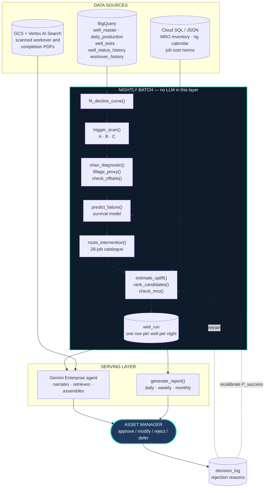

# 00 · Specification Overview

**System:** Agentic Workover Intervention Planning — ONGC Assam Asset (Geleki)
**Version:** 1.0 · **Date:** 2026-09-23
**Status:** Specification phase. **No implementation until every document in §4 is reviewed and signed off.**

---

## 1. Purpose and scope

### 1.1 What this system does

> **Every night, for every well in the asset: decide whether it needs attention, diagnose why, predict when it will fail, select the specific intervention job, price it, check the materials, and place a draft plan in front of the Asset Manager for approval.**

### 1.2 What it explicitly does not do

| Excluded | Reason |
|---|---|
| Execute or dispatch any job | Every output stops at a human approval gate. ONGC is a PSU — visible sign-off is mandatory |
| Write to any ONGC system of record | Read-only in v1. The draft is an artefact, not a transaction |
| Real-time / SCADA control | The cadence is nightly batch, matching the asset's existing production-report rhythm |
| Reservoir simulation or history matching | Out of scope. The system reasons about **wellbore** condition and defers reservoir questions |
| Multi-asset rollout | Geleki only. Scale is a commercial conversation, not a v1 requirement |

### 1.3 Delivery context

This specification serves **two deliverables that must not diverge**:

| Deliverable | Audience | Defined in |
|---|---|---|
| **A 10-minute live demo** | ONGC Basin Manager / ED | [demo_flow.md](../demo_flow.md) v2.0 |
| **The product it is a demo of** | ONGC Asset Manager, daily | [decision_architecture.md](../decision_architecture.md) v1.1 |

> [!IMPORTANT]
> **The demo is a subset of the product, never a facade over it.** Any behaviour shown in the demo must be implemented by a real component specified here. Where something is staged or pre-computed for latency, it must be declared in [07_agent_spec.md](./07_agent_spec.md) §5.

---

## 2. Architecture



### 2.1 The one architectural rule

> [!CAUTION]
> **The language model narrates, retrieves and assembles. It never computes a number.**
>
> Every figure that appears in any output must be traceable to either a deterministic tool return value or a cited source document. This is not a style preference — it is the property that makes the tool-call trace worth showing, and it is the answer to *"how do I know it isn't making this up?"*

| Layer | Implementation | LLM involved? |
|---|---|---|
| Triggers | Deterministic thresholds on fitted curves | ❌ |
| Diagnosis | Published physics — Arps, Chan, fillage, nodal | ❌ |
| Mechanism → job | Lookup table, editable by ONGC | ❌ |
| Prediction | Survival model | ❌ |
| Economics | Explicit arithmetic, stated inputs | ❌ |
| **Narrative, retrieval, assembly** | **LLM** | ✅ **only here** |
| **Decision** | **Asset Manager** | Human |

---

## 3. Identifier and traceability scheme

Every requirement, contract and test carries a stable ID. **IDs are never reused or renumbered** — deprecated items are marked `DEPRECATED` and retained.

| Prefix | Meaning | Lives in |
|---|---|---|
| `FR-nnn` | Functional requirement | [01](./01_functional_requirements.md) |
| `NFR-nnn` | Non-functional requirement | [01](./01_functional_requirements.md) |
| `DC-nnn` | Data contract rule / invariant | [02](./02_data_contract.md) |
| `SD-nnn` | Synthetic data generation rule | [03](./03_synthetic_data_spec.md) |
| `TC-nnn` | Tool contract | [04](./04_tool_contracts.md) |
| `MS-nnn` | Model specification item | [05](./05_model_spec.md) |
| `RS-nnn` | Report specification item | [06](./06_report_spec.md) |
| `AS-nnn` | Agent specification item | [07](./07_agent_spec.md) |
| `AT-nnn` | Acceptance test | [08](./08_test_plan.md) |
| `RISK-nnn` | Identified risk with mitigation | [01](./01_functional_requirements.md) §6 |

**Every `FR` must map to at least one `AT`.** The traceability matrix in [08](./08_test_plan.md) §5 is generated, not hand-maintained — an unmapped requirement is a build failure.

---

## 4. Document set and sign-off

| # | Document | Owns | Status |
|---|---|---|---|
| **00** | This document | Architecture, conventions, glossary | ✅ Draft |
| **01** | [Functional requirements](./01_functional_requirements.md) | What the system must do, per act | ✅ Draft |
| **02** | [Data contract](./02_data_contract.md) | Schema, units, nullability, invariants | ✅ Draft |
| **03** | [Synthetic data spec](./03_synthetic_data_spec.md) | Distributions, generation order, validator | ✅ Draft |
| **04** | [Tool contracts](./04_tool_contracts.md) | Every tool signature, I/O, errors, examples | ✅ Draft |
| **05** | [Model spec](./05_model_spec.md) | Features, label, training, eval gates | ✅ Draft |
| **06** | [Report spec](./06_report_spec.md) | Daily / weekly / monthly, field by field | ✅ Draft |
| **07** | [Agent spec](./07_agent_spec.md) | System prompt, per-act behaviour, guardrails | ✅ Draft |
| **08** | [Test plan](./08_test_plan.md) | Acceptance tests + traceability matrix | ✅ Draft |

> [!IMPORTANT]
> **Sign-off gate.** No implementation begins until 00–08 are reviewed. The two open engineering questions in [01](./01_functional_requirements.md) §6 (`RISK-001` map renderer, `RISK-002` schema field availability) must be **answered**, not merely acknowledged — both change the design.

---

## 5. Fixed constants

These values appear in multiple documents. **They are defined here once and referenced, never restated with different values.** A change here is a change everywhere.

### 5.1 Asset parameters

| Constant | Value | Source |
|---|---|---|
| `FIELD` | Geleki, Assam Asset | Real ONGC field. **Discovered 1968, on production from c.1974.** *(Not "producing since 1968" — the two are six years apart and someone in the room will know it)* |
| `N_WELLS` | 142 | Demo scope |
| `WELL_ID_PREFIX` | `GK-` | e.g. `GK-129` |
| `HISTORY_MONTHS` | 36 | Daily production history depth |
| `N_RIGS` | 15 | Assam Asset workover rigs |
| `ASSET_SHORTFALL` | 10.66% below target | Apr'25–Jan'26, `research_appendix.md` |
| `ONGC_WORKOVERS_PER_YEAR` | ~2,320 | `research_appendix.md` §1.3 |

### 5.2 Reliability parameters — corrected 2026-09-23 (`D-15`)

> [!IMPORTANT]
> **The previous version of this table did not close, and the claim it supported was circular. Both are fixed. Read the honesty note below before quoting any of it.**

| Constant | Value | Provenance |
|---|---|---|
| `UPTIME_DIST` | `Weibull(β=2.0, η=216.7)` → **`E[uptime] = 192.0 d`** | Calibrated to MTBF ≈ 6.3 months |
| `DOWNTIME_DIST` | `LogNormal(μ=3.219, σ=1.142)`, **floored at 8 d** | Floor exists because unfloored `p05 = 3.8 d`, which would imply rigs mobilise in under four days |
| `E_DOWNTIME_RIG` | **48.5 d** | **The floored mean of `DOWNTIME_DIST`. Computed, not asserted** |
| `E_DOWNTIME_RIGLESS` | **2.0 d** | Rigless jobs, `RIGLESS_SHARE` of the population |
| `RIGLESS_SHARE` | **24%** | Derived in §5.3 from the corrected taxonomy |
| `E_DOWNTIME_BLENDED` | **37.3 d** | `0.76 × 48.5 + 0.24 × 2.0` |
| `FRACTION_DOWN_ACTIVE` | **16.3%** | `37.3 / (192.0 + 37.3)` — of the **actively-cycling** stock |
| `PERMANENTLY_IDLE` | **4.5%** | ⚠ **A FITTED PARAMETER.** See the honesty note |
| `FRACTION_DOWN_TOTAL` | **20.0%** | `0.955 × 16.3% + 4.5%` |
| `P967_DOWNTIME` | **204.1 d** | CAG observed max: **205 d** |

#### What was wrong, and it was not a rounding error

| Was | Is | Why |
|---|---|---|
| `E_DOWNTIME_RIG = 56.2 d` | **48.5 d** | **56.2 was unreachable.** `LogNormal(3.219, 1.142)` floored at 8 d has a mean of 48.5 d — and that is the mean of the *whole* distribution, so **no sub-population of it can average 56.2 d** |
| `E_DOWNTIME_BLENDED = 48.7 d` | **37.3 d** | **The blend was never actually applied.** The published 48.7 d *is* the unblended floored mean, with a blending narrative retrofitted onto it |
| `FRACTION_DOWN = 20.2%`, one population | **20.0%, two populations** | Actively-cycling wells and permanently-idle wells behave differently and must be modelled separately |

> [!CAUTION]
> **⚠ The honesty note. This replaces the old "three independent sources reconcile to within 0.2 percentage points" line, which was an artefact — do not say it.**
>
> **What is a genuine independent check:** `p96.7 = 204.1 d` against the **CAG-observed maximum of 205 d**. `μ` and `σ` were fixed on other grounds, so the tail landing on the CAG figure is real corroboration. **This one is worth saying.**
>
> **What is fitted, not corroborated:** the **4.5% permanently-idle carve-out is a free parameter, and it was chosen to land on the Tamil Nadu census figure of 20%.** That is legitimate calibration, but **it is not independent agreement and must never be presented as such.**
>
> **The defensible line is therefore:** *"Our downtime distribution's upper tail independently reproduces the CAG-audited maximum. The idle fraction is calibrated to the one published census we have."* **Two sentences, both true, and the second one openly concedes a fitted parameter.**
>
> **This is a weaker claim than the one it replaces, and it is the right trade.** An ED who asks *"reconcile that for me"* gets an answer that survives; the old one did not.

> [!WARNING]
> **`FRACTION_DOWN_TOTAL` must come back out of `generator/validate.py`, not off a calculator.** The `SCALE_SAND` split moved sand to a rig job and scale to a bullheaded rigless job, so the **per-code downtime weights changed too** — 20.0% is the target, not a guarantee. `DC-092` / `AT-092` now assert **20.0% ± 1.0pp**, widened from ±0.5pp because a fitted parameter does not deserve a tight tolerance.

### 5.3 Failure taxonomy — shares must hold ±3pp

> [!IMPORTANT]
> **The classification rule, declared — because the choice moves the Pareto and it is the first question a production engineer asks.**
>
> **We classify by the component that failed, not by the root cause.** Rod-on-tubing wear is the dominant wear mechanism in a rod-pumped well and it produces *two different failures*: if the wear parts a rod, it is `ROD_PART`; if the same wear holes the tubing, it is `TUBING_LEAK`. Counting both under "rod wear" would be defensible as a *cause* taxonomy, but it would make the tubing bucket vanish — which is exactly the error the first version of this table made.

| Code | Label | Share | Rigless? |
|---|---|---|---|
| `TUBING_LEAK` | Tubing leak / rod-on-tubing wear | **22%** | ❌ |
| `ROD_PART` | Rod parting | **18%** | ❌ |
| `WAX` | Paraffin / wax | **15%** | **Partly** — see below |
| `PUMP_WEAR` | Pump wear | **13%** | ❌ |
| `SURFACE` | Surface / power | 12% | ✅ |
| `OTHER` | Other / unknown | 8% | Mixed |
| `SUDDEN_MECH` | Sudden mechanical | 5% | ❌ |
| `SAND` | Sand / solids influx | **5%** | ❌ |
| `SCALE` | Scale | **2%** | ✅ *(bullheaded)* |

`PREDICTABLE_SHARE = 75%` — unchanged. `SURFACE 12 + OTHER 8 + SUDDEN_MECH 5 = 25%` carry no recoverable precursor.

#### What changed on 2026-09-23, and why

| Code | Was | Now | Reason |
|---|---|---|---|
| `TUBING_LEAK` | 7% | **22%** | Published bands put tubing at **30–45%** of SRP failures, often the largest single bucket. 7% was off by 4–5×. We sit below the published band because Assam's wax and sand load takes share the US datasets give to mechanical failure |
| `ROD_PART` | 30% | **18%** | Reduced to make room for tubing. The mechanical block (`TUBING_LEAK` + `ROD_PART` + `PUMP_WEAR`) is **53%**, against a published 30–40 / 20–30 / 30–45 split that assumes wax and sand are minor |
| `PUMP_WEAR` | 20% | **13%** | Same |
| `SCALE_SAND` | 3%, combined | **`SAND` 5% + `SCALE` 2%** | **Split, because they need different jobs.** Tipam sands at Geleki are poorly consolidated; sand production causes tubular abrasion, pump failure and valve obstruction, **and is worsened by the water breakthrough Geleki is known to have**. A combined 3% bucket both understated it and hid the fact that **sand control — screens and gravel pack — was missing as a job category** |
| `WAX` | 15% | **15%**, unchanged — but **flagged as a probable floor** | Upper Assam crude is reported at **11–25 wt% wax with a pour point near 30 °C**, against winter ambient below 10 °C. The crude sits below its pour point at surface. **If the Asset tells us wax is worse than 15%, raise it — do not argue** |

#### `RIGLESS_SHARE` — derived, not asserted

**No public rig-versus-rigless split exists for any mature onshore rod-pumped asset.** The figure is therefore computed from the corrected catalogue under `TC-008.6`:

```
SURFACE                 12%   surface crew                          rigless
SCALE                    2%   bullheaded acid                       rigless
WAX                     15%   of which ~2/3 hot oil / solvent /
                              inhibitor squeeze, annulus-circulated
                              (the remaining ~1/3 needs the tubing
                              scraped, which means pulling rods)    +10%
                                                                    ─────
RIGLESS_SHARE                                                        24%
```

> [!CAUTION]
> **`RIGLESS_SHARE = 24%`, and it is an arithmetic consequence of the taxonomy, not an industry benchmark.** The previous 27% was asserted. If the lift mix (`SD-015`) turns out to contain more gas-lifted or flowing wells, **this number rises sharply** — the rod string is what blocks wireline and coiled tubing, and those wells do not have one.

#### ⚠ Scope — this table is SRP only (`D-16`)

> [!WARNING]
> **§5.3 above describes rod-pumped wells, which are ~70% of the field under `SD-015`. It does not describe the other 43.**
>
> `TUBING_LEAK` + `ROD_PART` + `PUMP_WEAR` = **53% of this table, and all three are physically undefined on a well with no rod string.** Applying it field-wide would generate rod partings on gas-lifted wells.

| Population | Share of field | Taxonomy | Notes |
|---|---|---|---|
| **SRP** | ~70% | **§5.3, above** | The only one with a published evidence base |
| **Gas lift** | ~20% | [`03_synthetic_data_spec.md`](./03_synthetic_data_spec.md) **§6.2** (`SD-028`) | **No published failure-share distribution exists for gas lift.** Every share is assigned by us and labelled as such |
| **Natural flow** | ~10% | [`03_synthetic_data_spec.md`](./03_synthetic_data_spec.md) **`SD-032`** | No lift equipment ⟹ no lift-equipment failures |

**Two consequences that reach the screen:**

| # | Consequence |
|---|---|
| 1 | **`RIGLESS_SHARE = 24%` is the SRP figure.** Gas-lift wells are materially *more* rigless — valve changes run on slickline — so the blended field figure is **higher than 24%, and we do not yet know by how much.** Quote 24% as the rod-pump number and say so |
| 2 | **Compressor and injection-supply failures are field events, not well events** (`SD-031`). They are excluded from the failure taxonomy entirely, because no well failed. **This is the first filter the agent applies** — otherwise one compressor trip is reported as fourteen well failures |

### 5.4 Trigger thresholds

| Constant | Value |
|---|---|
| `TRIGGER_A_WATCH` | residual < −15% |
| `TRIGGER_A_FLAG` | residual < −25% |
| `TRIGGER_A_URGENT` | residual < −40% |
| `TRIGGER_A_PERSISTENCE` | 7 consecutive **producing** days |
| `TRIGGER_B_RULE` | `days_since_intervention > p50(this well's own prior run-lives)`, throughput-weighted |

### 5.5 Model performance gates

| Constant | Value | Meaning |
|---|---|---|
| `C_INDEX_MIN` | 0.65 | Below this, do not ship the model |
| `C_INDEX_EXPECTED` | **0.65–0.72** | **Honest band for a model seeing daily production data ONLY — no dynacard telemetry, no downhole gauges.** 25% of failures carry no recoverable precursor. **Lowered from 0.65–0.80: every published number above 0.72 at this data grade came from a vendor performance claim, which this project rejects outright** |
| `C_INDEX_LEAK_THRESHOLD` | **> 0.78 ⇒ investigate as a leak** | Not a win. On this feature set it almost always means the generator leaked the failure date into a covariate |
| `AUC_LEAK_THRESHOLD` | **> 0.95 = data leak**, not a good model | Hard build failure |
| `BASELINE_TO_BEAT` | Trigger B alone | If the model cannot beat it, the model is not needed |

> [!NOTE]
> **Reporting 0.68 and explaining the ceiling beats reporting 0.85 and being unable to.** The band is deliberately set where the evidence supports it. An ED who has been shown three vendor decks claiming 0.9-plus will notice which one of the four is telling the truth.

---

## 6. The Chan sign convention

> [!WARNING]
> **This is the single most dangerous convention in the system and it is stated once, here, normatively.**
>
> ```
> WOR′ slope NEGATIVE → CONING       → choke back        → RIGLESS, < 1 day
> WOR′ slope POSITIVE → CHANNELLING  → cement squeeze    → RIG, 5–10 days
> WOR′ plateau        → MULTILAYER   → selective isolation → RIG, 3–7 days
> ```
>
> **Physics, so it can be re-derived rather than memorised:** coning is gravity-opposed and *self-limiting* — the water column's hydrostatic head brakes the cone's growth as it approaches pseudo-steady state, so the derivative decays. Channelling through a high-permeability streak or behind pipe has no stabilising force, so the derivative holds or accelerates.
>
> **Inverted, this recommends a seven-day rig job on a well that needed a thirty-minute choke adjustment.** A research pass on this project produced the inverted mapping on 2026-09-23 and it was caught only by independent verification against the Chan literature. `TC-002` requires a unit test with known-coning and known-channelling fixtures, written **before** the implementation.

### 6.1 The fourth branch — injector breakthrough

> [!CAUTION]
> **Chan has three outputs. The field has four mechanisms. Injector breakthrough and formation channelling both produce a POSITIVE WOR′ slope and Chan cannot tell them apart.**

| | Formation channelling | Injector breakthrough |
|---|---|---|
| WOR′ slope | **POSITIVE** | **POSITIVE — identical** |
| Where the problem is | **This well** | **A neighbouring injector** |
| The job | Cement squeeze on the producer | **Reallocate or curtail injection at the injector** |
| Cost profile | **Rig, 5–10 days** | **Rigless, often zero capital** |
| Evidence needed | Chan slope alone is indicative | **The paired injector's rate history, lagged 20–70 days** |

**Geleki is under water injection.** The discriminating evidence therefore exists, but **it is not in the producer's own data** — it is the lagged rate step at the paired injector (`SD-034`…`SD-036`).

| Rule | Statement |
|---|---|
| **The rule** | A positive WOR′ slope alone yields `CHANNELLING_OR_INJECTOR_BREAKTHROUGH`, **not `CHANNELLING`.** It resolves to one or the other **only** when the paired-injector feature is present and unambiguous |
| **On ambiguity** | Recommend a **tracer or injection survey**, not a squeeze. **Naming two candidate mechanisms and the test that separates them is a better answer than confidently naming one** |

> **This is a real differentiator, and it costs one join.** Every single-well analytics product is structurally incapable of it, because it looks at one well at a time. It is also the cheapest credibility win available: a cement squeeze recommended on a well whose neighbour was simply over-injecting is the kind of error a reservoir engineer remembers.

---

## 7. Glossary

| Term | Meaning |
|---|---|
| **Arps decline** | Empirical production decline model. Hyperbolic form `q(t) = qᵢ / (1 + b·Dᵢ·t)^(1/b)` |
| **BOPD** | Barrels of oil per day |
| **CHP** | Casing head pressure. **Rises on pump wear**, flat on tubing leak |
| **Chan plot** | Log-log WOR and WOR′ vs time; diagnoses excess-water mechanism (SPE-30775) |
| **Coning** | Water drawn vertically up toward perforations. Self-limiting. Fixed by reducing drawdown |
| **Channelling** | Water travelling through a high-perm streak or behind casing. Progressive. Needs a squeeze |
| **CT** | Coiled tubing. Rigless intervention vehicle |
| **Deferred barrels** | Production lost while a well is down or underperforming. The system's value currency |
| **Fillage / fluid pound** | Pump displacing more than the well delivers; plunger slams into fluid, fatiguing the rod string |
| **Offset wells** | Geometric neighbours. Used to separate reservoir problems from wellbore problems |
| **PI** | Productivity index — rate per unit drawdown |
| **Rigless** | Intervention needing no workover rig and no pulling unit. **On an SRP well this means annulus circulation, bullheading, squeezes and surface work only** — hot oiler, pump truck, surface crew. **Not slickline or CT: the rod string blocks the tubing** (`TC-008.6`). Share ⚠ **unverified — see below** |
| **Right censoring** | A well still running at the end of observation — its failure time is unknown but bounded below |
| **Run-life** | Interval between successive interventions on the same well |
| **SRP** | Sucker rod pump. The dominant lift type in this asset |
| **Stripper well** | Low-rate well, conventionally < 10 BOPD. Much of this asset is near this band |
| **THP** | Tubing head pressure. **Wax indicator only** — not a pump-wear signal on a flowline-connected well |
| **WOR / WOR′** | Water-oil ratio and its derivative `d(WOR)/d(ln t)` |
| **Workover** | Rig-requiring well intervention |

---

## 8. Conventions

| Area | Convention |
|---|---|
| **Units** | Rates in **BOPD / BWPD / MSCFD**. Pressures in **kg/cm²** (ONGC onshore convention) with psi in parentheses where quoted. Depths in **metres MD** unless stated TVD. Volumes in **bbl** |
| **Dates** | ISO 8601 (`YYYY-MM-DD`). All timestamps UTC; display in IST |
| **Currency** | INR crore for asset-level figures. **No absolute per-job cost figures** — none are published. Relative bands only |
| **Null handling** | Missing production is `NULL`, never `0`. A zero rate means measured zero. This distinction drives Trigger A's "producing days" logic |
| **Naming** | `snake_case` for tables, columns and Python. `camelCase` never used |
| **Language** | British English in all prose |

> [!CAUTION]
> **`NULL` vs `0` is a real defect source.** Trigger A requires "7 consecutive **producing** days." If downtime is written as `0` rather than `NULL`, a shut-in well reads as catastrophically below its decline curve and floods the queue with false positives. `DC-014` makes this an enforced invariant.

---

## 9. Evidence standard

This project maintains a **rejected-claims register** in [research_appendix.md](../research_appendix.md) §3. It applies to this specification.

| Rule | Consequence |
|---|---|
| Uncited numbers are unusable | Remove, or mark `[ILLUSTRATIVE]` and never quote |
| Vendor performance claims are rejected outright | e.g. *"ML reduces downtime 30%"* — rejected |
| An abstract is not the paper | If only the abstract was read, say so. Inferences from abstracts are retracted on challenge |
| Conflicting figures → both shown, with the discrepancy named | Several public ONGC figures are wrong by an order of magnitude |
| Costs: *"not published"* beats a plausible guess | No public Indian onshore workover rig day rate exists |
