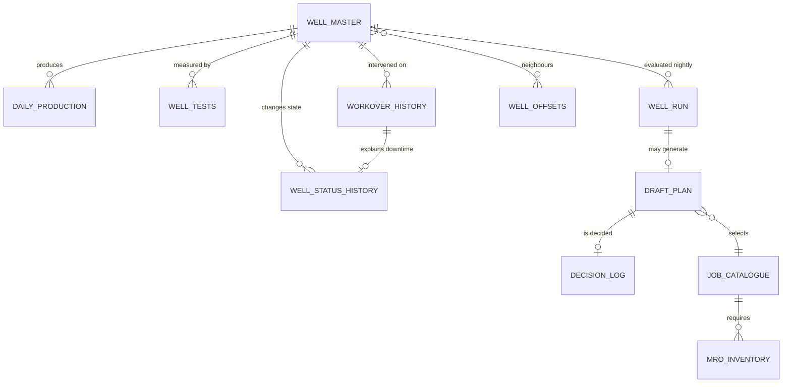

# 02 · Data Contract

**Version:** 1.0 · **Date:** 2026-09-23
**Parent:** [00_overview.md](./00_overview.md) · **Consumed by:** [03](./03_synthetic_data_spec.md), [04](./04_tool_contracts.md), [05](./05_model_spec.md), [06](./06_report_spec.md)

---

## 0. The answer, first

> **Two tables decide whether this system can exist at all: `well_status_history` with reason codes, and `workover_history` with outcomes. Everything structural — Trigger B, P(success), deferred-barrel accounting and the survival label — dies without them. Every other table is a convenience by comparison.**

This document is the single source of truth for schema. **Any field not listed here does not exist.** Adding a field is a spec change, not an implementation detail.

---

## 1. Entity relationships



| Table | Grain | Rows (demo) | Tier |
|---|---|---|---|
| `well_master` | one per well | 142 | Structured |
| `daily_production` | well × day | ~155,000 | Structured |
| `well_tests` | well × test event | ~5,100 | Structured |
| `well_status_history` | well × status episode | ~900 | **Structured ⚠ critical** |
| `workover_history` | well × intervention | ~700 | **Structured ⚠ critical** |
| `well_offsets` | well × neighbour | ~850 | Derived |
| `job_catalogue` | one per job type | 28 | **Configuration** |
| `mro_inventory` | item × base | ~200 | Operational |
| `rig_calendar` | rig × day | ~5,500 | Operational |
| `well_run` | well × run date | 142/night | **Derived — the spine** |
| `draft_plan` | one per flagged well per run | ~15/night | Derived |
| `decision_log` | one per human decision | grows | **Feedback** |
| `document_index` | one per scanned PDF | ~50 | Unstructured |

---

## 2. `well_master`

One row per well. Static or slowly-changing attributes.

```sql
CREATE TABLE well_master (
  well_id              STRING    NOT NULL,  -- 'GK-129'. PK
  field                STRING    NOT NULL,  -- 'Geleki'
  asset                STRING    NOT NULL,  -- 'Assam'
  latitude             FLOAT64   NOT NULL,  -- WGS84 decimal degrees
  longitude            FLOAT64   NOT NULL,
  spud_date            DATE,
  completion_date      DATE      NOT NULL,
  current_zone         STRING    NOT NULL,  -- 'Tipam' | 'Barail' | 'Lakadong'
  perf_top_m           FLOAT64   NOT NULL,  -- MD metres
  perf_bottom_m        FLOAT64   NOT NULL,
  total_depth_md_m     FLOAT64   NOT NULL,
  total_depth_tvd_m    FLOAT64   NOT NULL,
  max_dls_deg_30m      FLOAT64,             -- dogleg severity. DEMOTED, see note
  lift_type            STRING    NOT NULL,  -- 'SRP' | 'GAS_LIFT' | 'PCP' | 'NATURAL'
  -- SRP geometry: REQUIRED for the fillage proxy. See RISK-002.
  plunger_diameter_in  FLOAT64,             -- ⚠ 1.25 | 1.5 | 1.75 | 2.0
  stroke_length_in     FLOAT64,             -- ⚠ 54 | 64 | 74 | 86 | 100
  pump_setting_depth_m FLOAT64,             -- ⚠
  rod_string_grade     STRING,              -- ⚠ 'D' | 'K' | 'C'
  pump_type            STRING,              -- 'INSERT' | 'TUBING'
  casing_vented        BOOL      NOT NULL,  -- ⚠ see DC-021
  tubing_size_in       FLOAT64,
  casing_size_in       FLOAT64,
  status               STRING    NOT NULL,  -- 'ACTIVE' | 'IDLE' | 'ABANDONED'
  PRIMARY KEY (well_id) NOT ENFORCED
);
```

| Rule | Statement |
|---|---|
| **DC-001** | `well_id` matches `^GK-\d{3}$` and is unique |
| **DC-002** | `perf_top_m < perf_bottom_m ≤ total_depth_md_m` |
| **DC-003** | `total_depth_tvd_m ≤ total_depth_md_m` |
| **DC-004** | Where `lift_type = 'SRP'`, all four ⚠ geometry fields are `NOT NULL`. **Enforced, not advisory** — `TC-003` cannot run without them |
| **DC-005** | `latitude`/`longitude` fall inside the Geleki field polygon |
| **DC-006** | `completion_date ≥ 1968-01-01`. **Geleki was *discovered* in 1968 and came *on production* c.1974** — the 1968 floor is a deliberately safe lower bound on the data, **not a claim that the field produced from 1968.** Do not restate it as one |
| **DC-007b** | All four depth fields are `NOT NULL` and are generated by [`03_synthetic_data_spec.md`](./03_synthetic_data_spec.md) `SD-013b`…`SD-013d`. **Verified anchors: Tipam producers ≈ 2,400–3,100 m; Geleki field-wide drilling 2,400–4,000 m.** A prior "3,000–4,200 m" claim is **refuted** — see [`research_appendix.md`](../research_appendix.md) §3.1 |

> [!NOTE]
> **`max_dls_deg_30m` is retained but demoted.** Geleki-era wells are near-vertical; DLS has near-zero variance across this population and carries no discriminating information. It is kept for the minority of deviated wells and because removing a field is harder than ignoring one. **It must not appear as a headline model feature** — see [05](./05_model_spec.md) `MS-012`.

> [!CAUTION]
> **`casing_vented` is not cosmetic.** The "CHP rises on pump wear, stays flat on tubing leak" discriminator assumes the casing valve is closed. If the casing is vented to a flowline, CHP tracks flowline pressure and the discriminator is lost. `TC-005` must return `DISCRIMINATOR_UNAVAILABLE` for vented wells rather than producing a confident wrong answer.

---

## 3. `daily_production`

One row per well per calendar day. **The highest-volume table and the source of every trigger.**

```sql
CREATE TABLE daily_production (
  well_id            STRING   NOT NULL,
  production_date    DATE     NOT NULL,
  oil_rate_bopd      FLOAT64,            -- NULL = not producing. NEVER 0 for downtime
  water_rate_bwpd    FLOAT64,
  gas_rate_mscfd     FLOAT64,
  liquid_rate_blpd   FLOAT64,            -- generated column: oil + water
  water_cut_pct      FLOAT64,            -- generated: water / liquid * 100
  gor_scf_bbl        FLOAT64,            -- generated: gas*1000 / oil
  thp_kgcm2          FLOAT64,            -- tubing head pressure
  chp_kgcm2          FLOAT64,            -- ⚠ casing head pressure
  choke_size_64th    INT64,              -- choke setting; change invalidates Trigger A
  spm                FLOAT64,            -- ⚠ strokes per minute
  runtime_hours      FLOAT64,            -- ⚠ 0.0 to 24.0
  runtime_fraction   FLOAT64,            -- generated: runtime_hours / 24
  is_producing       BOOL     NOT NULL,  -- ⚠ see DC-014
  downtime_reason    STRING,             -- FK to failure taxonomy; NULL if producing
  data_source        STRING   NOT NULL,  -- 'ALLOCATED' | 'TESTED' | 'ESTIMATED'
  PRIMARY KEY (well_id, production_date) NOT ENFORCED
)
PARTITION BY production_date
CLUSTER BY well_id;
```

| Rule | Statement |
|---|---|
| **DC-010** | `liquid_rate_blpd = oil_rate_bopd + water_rate_bwpd`, tolerance 0.01 |
| **DC-011** | `water_cut_pct ∈ [0, 100]`. For this asset the working population sits at **60–92%** |
| **DC-012** | `0 ≤ runtime_hours ≤ 24` |
| **DC-013** | Exactly `HISTORY_MONTHS` of continuous daily rows per well — **no gaps**. A missing well-day is a defect, not an absence |
| **DC-014** ⚠ | **When `is_producing = FALSE`, all rate fields are `NULL`, never `0`.** When `TRUE`, `oil_rate_bopd IS NOT NULL` |
| **DC-015** | `downtime_reason IS NOT NULL` ⟺ `is_producing = FALSE` |
| **DC-016** | `data_source = 'TESTED'` only on dates with a matching `well_tests` row |
| **DC-017** | `gor_scf_bbl` is `NULL` when `oil_rate_bopd = 0` — not infinity, not a sentinel |

> [!CAUTION]
> **DC-014 is the single most defect-prone rule in the contract.**
>
> `TRIGGER_A_PERSISTENCE` requires *"7 consecutive **producing** days."* If downtime is written as `0` instead of `NULL`:
> - Every shut-in well reads as ~100% below its decline curve
> - The queue floods with wells that are already down
> - The trigger fires on the one condition it is specifically designed to pre-empt
>
> `AT-014` asserts zero rows with `is_producing = FALSE AND oil_rate_bopd IS NOT NULL`.

> [!NOTE]
> **`data_source` matters for honesty.** Most daily values at ONGC onshore are **allocated**, not measured — a field total apportioned across wells. Only `well_tests` dates are measured. Carrying this distinction lets the system express appropriate uncertainty, and pre-empts *"your daily numbers aren't real measurements"* from a production engineer.

---

## 4. `well_tests`

Periodic measured well tests. **Every 14–30 days, never daily.**

```sql
CREATE TABLE well_tests (
  test_id            STRING   NOT NULL,
  well_id            STRING   NOT NULL,
  test_date          DATE     NOT NULL,
  test_duration_hr   FLOAT64  NOT NULL,
  oil_rate_bopd      FLOAT64  NOT NULL,
  water_rate_bwpd    FLOAT64  NOT NULL,
  gas_rate_mscfd     FLOAT64,
  thp_kgcm2          FLOAT64,
  chp_kgcm2          FLOAT64,
  fluid_level_m      FLOAT64,            -- acoustic shot. See note
  pump_intake_p_kgcm2 FLOAT64,
  test_quality       STRING   NOT NULL,  -- 'GOOD' | 'SUSPECT' | 'REJECTED'
  PRIMARY KEY (test_id) NOT ENFORCED
);
```

| Rule | Statement |
|---|---|
| **DC-020** | Inter-test interval per well ∈ [14, 30] days, ±3 days jitter |
| **DC-021** | `test_quality = 'REJECTED'` rows are excluded from all fitting and all model features |
| **DC-022** | ~5% of tests are `SUSPECT` and ~2% `REJECTED`. Perfect test data is not credible |

> [!TIP]
> **`fluid_level_m` is the cheapest high-value field in the entire contract.** An acoustic fluid-level shot is a one-hour rigless job, and it is the only measurement that cleanly separates *"the reservoir won't give it"* (pumped off, low fluid level) from *"the pump won't lift it"* (high fluid level, pump underperforming). It is `NULLABLE` because ONGC may not run them routinely — **open question 7 in [build_plan.md](../build_plan.md) §8.**

---

## 5. `well_status_history` ⚠ CRITICAL

Status episodes. **Precondition C2 in the Problem Statement — flagged as make-or-break.**

```sql
CREATE TABLE well_status_history (
  episode_id       STRING   NOT NULL,
  well_id          STRING   NOT NULL,
  status           STRING   NOT NULL,  -- 'PRODUCING' | 'SHUT_IN' | 'UNDER_WORKOVER'
                                       -- | 'WAITING_ON_RIG' | 'WAITING_ON_MATERIAL'
  start_date       DATE     NOT NULL,
  end_date         DATE,               -- NULL = currently open
  reason_code      STRING,             -- ⚠ 8-code taxonomy. NULL only if PRODUCING
  is_rigless       BOOL,               -- ⚠ NULL only if PRODUCING
  workover_id      STRING,             -- FK where the episode is an intervention
  deferred_bbl     FLOAT64,            -- computed at episode close
  PRIMARY KEY (episode_id) NOT ENFORCED
);
```

| Rule | Statement |
|---|---|
| **DC-030** | Episodes per well are contiguous and non-overlapping; they tile the full history |
| **DC-031** | Exactly one open episode (`end_date IS NULL`) per well |
| **DC-032** | `reason_code` ∈ the 8-code taxonomy (`00_overview` §5.3) whenever `status ≠ 'PRODUCING'` |
| **DC-033** | `is_rigless = TRUE` share across all non-producing episodes = `RIGLESS_SHARE ± 3pp` |
| **DC-034** | `WAITING_ON_RIG` episodes are ≥ 8 days — the rig-mobilisation floor |
| **DC-035** | `deferred_bbl` = episode duration × the well's fitted expected rate over that window |

> [!IMPORTANT]
> **This table is the ask.** The strongest thing the demo can say to ONGC is *"the one thing we need from you is this table"* — and by that point they will have seen exactly why. Without reason codes there is no survival label, no Trigger B, no P(success) and no deferred-barrel accounting.
>
> **`is_rigless` earns its place independently:** it is the quantified answer to *"our rig fleet is already saturated"* — **24%** of the work does not need a rig at all.

---

## 6. `workover_history` ⚠ CRITICAL

One row per completed intervention. **The survival-analysis event table.**

```sql
CREATE TABLE workover_history (
  workover_id        STRING   NOT NULL,
  well_id            STRING   NOT NULL,
  start_date         DATE     NOT NULL,
  end_date           DATE     NOT NULL,
  job_code           STRING   NOT NULL,  -- FK to job_catalogue (28 rows)
  failure_code       STRING   NOT NULL,  -- 8-code taxonomy: what failed
  is_rigless         BOOL     NOT NULL,
  rig_id             STRING,             -- NULL when rigless
  rig_days           FLOAT64  NOT NULL,  -- 0.0 when rigless
  pre_job_oil_bopd   FLOAT64  NOT NULL,
  post_job_oil_bopd  FLOAT64,            -- NULL if not yet stabilised
  uplift_bopd        FLOAT64,            -- generated
  outcome            STRING   NOT NULL,  -- 'SUCCESS' | 'PARTIAL' | 'FAILED'
  run_life_days      FLOAT64,            -- days until the NEXT failure. NULL = censored
  is_censored        BOOL     NOT NULL,  -- TRUE = still running at observation end
  damage_reset_frac  FLOAT64,            -- 0.0-1.0, how much damage this job cleared
  report_doc_id      STRING,             -- FK to document_index
  PRIMARY KEY (workover_id) NOT ENFORCED
);
```

| Rule | Statement |
|---|---|
| **DC-040** | `end_date ≥ start_date`; `rig_days = 0` ⟺ `is_rigless = TRUE` |
| **DC-041** | `run_life_days IS NULL` ⟺ `is_censored = TRUE`. **Censoring is information, not missingness** |
| **DC-042** | `outcome` distribution is realistic: ~60–70% `SUCCESS`. **100% success is not credible** |
| **DC-043** | `job_code` is consistent with `failure_code` per the mechanism→job catalogue |
| **DC-044** | Each well has ≥ 2 prior interventions so Trigger B has a p50 to compute; wells with fewer return `INSUFFICIENT_HISTORY` |
| **DC-045** | Mean uncensored `run_life_days` ≈ `E[uptime] = 192.0 d`, tolerance ±10% |
| **DC-046** | ~40% of the most recent episodes are censored. A dataset with no censoring is a dataset that has been quietly truncated |

---

## 7. `job_catalogue` — configuration, not code

The 28-row mechanism→job table from [decision_architecture.md §3.1](../decision_architecture.md). **`NFR-006`: ONGC engineers edit this without a deployment.**

```sql
CREATE TABLE job_catalogue (
  job_code            STRING   NOT NULL,  -- 'WAX_HOTOIL', 'WSO_SQUEEZE', ...
  job_name            STRING   NOT NULL,
  category            STRING   NOT NULL,  -- 'WAX'|'MECHANICAL'|'DEPOSITION'
                                          -- |'INFLOW'|'WATER_CONTROL'|'TERMINAL'
  mechanism_code      STRING   NOT NULL,  -- what it addresses
  selection_evidence  STRING   NOT NULL,  -- human-readable rule
  requires_rig        BOOL     NOT NULL,
  equipment           STRING   NOT NULL,  -- 'SLICKLINE'|'CT'|'HOT_OILER'
                                          -- |'PULLING_UNIT'|'WORKOVER_RIG'|'SURFACE_CREW'
  duration_days_min   FLOAT64  NOT NULL,
  duration_days_max   FLOAT64  NOT NULL,
  cost_band           STRING   NOT NULL,  -- 'LOW'|'MED'|'HIGH'. NOT an amount
  damage_reset_frac   FLOAT64  NOT NULL,
  is_active           BOOL     NOT NULL,
  PRIMARY KEY (job_code) NOT ENFORCED
);
```

| Rule | Statement |
|---|---|
| **DC-050** | Exactly 28 rows, matching `decision_architecture.md` §3.1 one-for-one |
| **DC-051** | `NO_JOB_JUSTIFIED` exists as row 27 with `requires_rig = FALSE`, zero duration |
| **DC-052** | Re-perforation and add-perforation have `requires_rig = TRUE`. **On an SRP well the rod string blocks a perforating gun** |
| **DC-053** | Rows with `requires_rig = FALSE` sum to `RIGLESS_SHARE ± 3pp` of generated failures |
| **DC-054** | **No absolute cost figures.** `cost_band` only — no public Indian onshore workover rig day rate exists |

---

## 8. `well_run` — the spine

One row per well per nightly run. **Everything downstream reads this and nothing recomputes it.**

```sql
CREATE TABLE well_run (
  run_date             DATE     NOT NULL,
  well_id              STRING   NOT NULL,
  -- decline fit
  arps_qi              FLOAT64,
  arps_b               FLOAT64,
  arps_di              FLOAT64,
  arps_r2              FLOAT64,
  expected_oil_bopd    FLOAT64,
  actual_oil_bopd      FLOAT64,
  residual_pct         FLOAT64,
  -- triggers
  trigger_a            STRING,            -- NULL|'WATCH'|'FLAG'|'URGENT'
  trigger_a_days       INT64,
  trigger_b            BOOL,
  trigger_b_p50_days   FLOAT64,
  trigger_c            STRING,            -- NULL | signature name
  trigger_d            BOOL,
  -- diagnosis
  mechanism            STRING,
  mechanism_confidence STRING,            -- 'HIGH'|'MEDIUM'|'LOW'
  chan_class           STRING,            -- 'CONING'|'CHANNELLING'|'MULTILAYER'|'NORMAL'
  chan_wor_slope       FLOAT64,
  fillage_gap_blpd     FLOAT64,
  offset_verdict       STRING,            -- 'WELL_SPECIFIC'|'RESERVOIR_DECLINE'|'INSUFFICIENT'
  rejected_mechanisms  JSON,
  -- prediction
  ettf_days            FLOAT64,
  ettf_ci_low          FLOAT64,
  ettf_ci_high         FLOAT64,
  hazard               FLOAT64,
  -- job + value
  recommended_job_code STRING,            -- FK job_catalogue
  requires_rig         BOOL,
  est_duration_days    FLOAT64,
  p_success            FLOAT64,
  p_success_n          INT64,             -- sample size behind p_success
  deferred_bbl_avoided FLOAT64,
  net_value            FLOAT64,
  priority             FLOAT64,           -- net_value / rig_days
  rank_overall         INT64,
  rank_within_queue    INT64,
  queue                STRING,            -- 'RIG'|'RIGLESS'|'NONE'
  logistics_blocker    STRING,            -- NULL = schedulable. Otherwise the
                                          -- governing blocker, e.g. '5.5in retainer
                                          -- not at NAZIRA'. Drives the daily report's
                                          -- 'blocker cleared' section (RS-024)
  earliest_start_date  DATE,              -- from check_mro(); NULL if unblocked
  -- provenance
  tool_trace           JSON     NOT NULL, -- every call, input hash, output, duration
  model_version        STRING,
  config_version       STRING,
  -- as-of correctness (DP-006 … DP-008)
  data_as_of           DATE     NOT NULL, -- latest production date actually PRESENT
                                          -- for this well. NOT the run date.
  data_lag_days        INT64    NOT NULL, -- run_date − data_as_of, in IST days
  run_confidence       STRING   NOT NULL, -- 'NORMAL'|'LOW_CONFIDENCE'|'EXCLUDED'
  confidence_reason    STRING,            -- why, when not NORMAL. Rendered verbatim
                                          -- by the agent — this is the sentence the
                                          -- ED hears when the data is thin
  tested_days_90d      INT64,             -- count of data_source='TESTED' days in the
                                          -- trailing 90d. Drives DP-002 capping
  allocation_basis_id  STRING,            -- GGS + well-test vintage. A change here is
                                          -- a BASIS change, not a rate change (DP-003)
  PRIMARY KEY (run_date, well_id) NOT ENFORCED
)
PARTITION BY run_date;
```

| Rule | Statement |
|---|---|
| **DC-060** | Exactly `N_WELLS` rows per `run_date`. **Every well is evaluated, including healthy ones** |
| **DC-061** | `recommended_job_code IS NOT NULL` whenever any trigger fired |
| **DC-062** | `queue = 'NONE'` ⟺ `recommended_job_code = 'NO_JOB_JUSTIFIED'` |
| **DC-063** | `priority = net_value / GREATEST(rig_days, 1)`; rigless ranked in a separate queue |
| **DC-064** | `tool_trace` is `NOT NULL` for every row. **`FR-083` provenance depends on it** |
| **DC-065** | `offset_verdict = 'RESERVOIR_DECLINE'` ⟹ `recommended_job_code = 'NO_JOB_JUSTIFIED'` |
| **DC-066** | Rows are immutable once written. A re-run writes a new `run_date` partition |
| **DC-067** | **`data_as_of` is the latest production date actually present for that well — never the run date, never a field-wide maximum.** A well with stale data must show its own staleness (`DP-006`) |
| **DC-068** | `data_lag_days = DATE_DIFF(run_date, data_as_of, DAY)`, **computed in IST** (`DP-008`). A bare UTC cast shifts every daily rate by a day and is invisible until someone reconciles against the GGS |
| **DC-069** | `data_lag_days > 3` ⟹ `run_confidence = 'LOW_CONFIDENCE'` and `confidence_reason IS NOT NULL` (`DP-007`) |
| **DC-070** | **`tested_days_90d = 0` ⟹ `trigger_a` may not be `'URGENT'`.** A residual computed entirely from allocated data cannot escalate on its own (`DP-002`). It may still reach `'FLAG'`, and `trigger_b` / `trigger_d` are unaffected because runtime is observed, not allocated (`DP-004`) |
| **DC-071** | **A change in `allocation_basis_id` between consecutive runs marks the step as a basis change, not a rate change** (`DP-003`). `TC-001` must not fit a decline across it |
| **DC-072** | `run_confidence = 'EXCLUDED'` ⟹ the well is absent from every ranking, **and the exclusion is reported, not silent.** *"Eleven wells are excluded from tonight's ranking: no production data since the 19th"* is a better answer than a complete-looking list |

> [!IMPORTANT]
> **`DC-067`…`DC-072` exist because most ONGC onshore daily per-well production is *allocated*, not measured.** A back-allocated rate moves when a **neighbour's** well test changes, not because anything happened at that well. Fed naively into a decline-residual trigger, an allocation artefact is indistinguishable from a mechanical failure. See [`data_pipeline.md`](../data_pipeline.md) §5 — it is the single largest data-sourcing risk on this project.

---

## 9. `decision_log` — the feedback asset

```sql
CREATE TABLE decision_log (
  decision_id      STRING    NOT NULL,
  draft_plan_id    STRING    NOT NULL,
  well_id          STRING    NOT NULL,
  run_date         DATE      NOT NULL,
  decided_at       TIMESTAMP NOT NULL,
  decided_by       STRING    NOT NULL,
  decision         STRING    NOT NULL,  -- 'APPROVE'|'MODIFY'|'REJECT'|'DEFER'
  reason_text      STRING,              -- MANDATORY when REJECT or MODIFY
  reason_category  STRING,              -- derived, for aggregation
  modified_job_code STRING,             -- when MODIFY
  PRIMARY KEY (decision_id) NOT ENFORCED
);
```

| Rule | Statement |
|---|---|
| **DC-070** | `decision IN ('REJECT','MODIFY')` ⟹ `reason_text IS NOT NULL AND LENGTH(reason_text) > 0` |
| **DC-071** | `reason_category` is derived by classification, never entered free-form by the user |
| **DC-072** | Append-only. Decisions are never updated or deleted |

> [!IMPORTANT]
> **This is the most valuable table the system will ever produce.** Every *"no, because…"* is a labelled correction encoding tacit knowledge nobody has written down. After 200 of them, ONGC owns a machine-readable record of how its best engineers actually reason — which no vendor can sell them.

---

## 10. Supporting tables

### 10.1 `well_offsets`
```sql
CREATE TABLE well_offsets (
  well_id        STRING  NOT NULL,
  offset_well_id STRING  NOT NULL,
  distance_m     FLOAT64 NOT NULL,
  same_zone      BOOL    NOT NULL,
  rank           INT64   NOT NULL
);
```
**DC-080:** `k = 6` nearest neighbours per well, `same_zone = TRUE` preferred. `TC-004` uses only same-zone offsets where ≥3 exist.

### 10.2 `mro_inventory`
```sql
CREATE TABLE mro_inventory (
  item_code       STRING  NOT NULL,
  item_name       STRING  NOT NULL,
  base            STRING  NOT NULL,   -- 'NAZIRA' | 'SIVASAGAR'
  qty_on_hand     INT64   NOT NULL,
  transit_days    INT64   NOT NULL    -- to the primary base
);
```
**DC-081:** at least one item required by a demo job is out of stock at Nazira and available at Sivasagar with `transit_days = 2`. The stock-out beat needs a real stock-out.

### 10.3 `rig_calendar`
```sql
CREATE TABLE rig_calendar (
  rig_id      STRING NOT NULL,   -- 'WO-1' .. 'WO-15'
  date        DATE   NOT NULL,
  status      STRING NOT NULL,   -- 'AVAILABLE'|'COMMITTED'|'MOVING'|'MAINTENANCE'
  well_id     STRING,
  rig_class   STRING NOT NULL    -- 'PULLING_UNIT'|'CLASS_I'|'CLASS_II'
);
```
**DC-082:** `N_RIGS = 15`. **DC-083:** rig capability must match `job_catalogue.equipment` — a pulling unit cannot run a cement squeeze.

### 10.4 `document_index`
```sql
CREATE TABLE document_index (
  doc_id       STRING NOT NULL,
  well_id      STRING,
  doc_type     STRING NOT NULL,  -- 'COMPLETION_REPORT'|'WORKOVER_REPORT'|'OTHER'
  doc_date     DATE   NOT NULL,
  gcs_uri      STRING NOT NULL,
  title        STRING NOT NULL,
  has_text_layer BOOL NOT NULL
);
```
**DC-084:** ≥ 40 documents spanning 1998–2024, including ≥ 5 with no `well_id` so retrieval demonstrably *selects* rather than returning everything.

---

## 11. Global invariants — validated on every build

| ID | Invariant | Failure mode if violated |
|---|---|---|
| **DC-090** | Mass balance: `SUM(daily_production.oil)` over an episode ≈ reported cumulative, ±2% | Data is physically impossible; an engineer spots it immediately |
| **DC-091** | Water cut is monotonically non-decreasing on a 90-day rolling mean, except across a water-shutoff job | Water cut does not spontaneously fall in a mature waterflood |
| **DC-092** | Computed from `well_status_history`: `FRACTION_DOWN_ACTIVE` = **16.3% ± 1.0pp** *and* `FRACTION_DOWN_TOTAL` = **20.0% ± 1.0pp**. Corrected 2026-09-23 (`D-15`) — was `FRACTION_DOWN` 20.2% ± 0.5pp, one population | The availability identity breaks; the spoken demo beat becomes false |
| **DC-093** | Failure-code distribution matches `00_overview` §5.3 ±3pp | Taxonomy drift invalidates the rigless-capacity argument |
| **DC-094** | Every well has ≥ 2 prior interventions **or** is explicitly marked `INSUFFICIENT_HISTORY` | Trigger B silently fails on a subset |
| **DC-095** | No well has a rate of exactly 0 while `is_producing = TRUE` | `NULL`/`0` confusion — see `DC-014` |
| **DC-096** | Every `well_run` row has a non-empty `tool_trace` | `FR-083` provenance claim becomes unverifiable |
| **DC-097** | Referential integrity holds across all FKs | — |

> [!CAUTION]
> **These run on every regeneration, not once.** The availability identity (`DC-092`) underpins a spoken beat in the demo. If a parameter tweak silently breaks it, the claim becomes false and nobody notices until someone in the room does the arithmetic.

> [!CAUTION]
> **Corrected 2026-09-23 (`D-15`).** The note here previously quoted *"three independent sources agree to within 0.2 percentage points."* **That claim was circular and is withdrawn — do not reinstate it, and do not say it.** Only the downtime **upper tail** is genuinely corroborated (`p96.7 = 204.1 d` against the CAG-audited maximum of 205 d); `FRACTION_DOWN_TOTAL = 20.0%` is **fitted** through a 4.5% permanently-idle carve-out. Both figures must come back out of `generator/validate.py`, never off a calculator. See [00 §5.2](./00_overview.md) and [03 §3](./03_synthetic_data_spec.md).

---

## 12. What must be true — the ask to ONGC

Ordered by how much dies without it.

| # | Requirement | Likely ONGC source | If missing |
|---|---|---|---|
| **1** | **`well_status_history` with reason codes**, 24+ months | **Probably nowhere clean. We reconstruct it** — [`data_pipeline.md`](../data_pipeline.md) §4 | Trigger B dies · P(success) dies · no survival label · no deferred-barrel value case. **The system does not exist** |
| **2** | **`workover_history` with dated outcomes** | Scanned workover completion reports; possibly SAP-ICE work orders. **⚠ NOT VERIFIED that EPINET holds it** | No run-life distribution, no baseline, no calibration |
| 3 | Daily or near-daily production, 24+ months, **with the allocated/tested flag** | Asset daily production reporting / SCADA via GGS | Triggers A and C degrade to monthly resolution — **and without the flag, `DC-070` cannot be enforced at all** |
| 4 | **Well test records** | **EPINET** ✅ *verified data class* | Decline fits lose their anchor (`DP-001`) |
| 5 | **Well master + surveyed coordinates** | **EPINET** ✅ *verified data class* + survey/GIS | No map. **Coordinates are never synthesised** (`TC-016.1`) |
| 6 | SRP geometry — plunger, stroke, SPM, runtime, CHP | **`RISK-002` — unknown whether captured** | Fillage proxy unavailable; top mechanical feature lost |
| 7 | **The actual artificial-lift split** | Asset | The 70/20/10 in `SD-015` stays an assumption. **SPE-194798 suggests 20% gas lift is low** |
| 8 | Job cost and duration norms | Asset / SAP-ICE | Ranking becomes barrels-only, ignoring the actual scarce resource |
| 9 | MRO inventory | SAP-ICE *(Project ICE is ONGC's SAP ERP backbone)* | Drop the logistics block; plans become less actionable |
| 10 | Acoustic fluid levels | Asset, if acquired | *Nice to have, disproportionate value* — separates reservoir from lift |

**#1 and #2 are the ones to ask for first.** They are also the two the demo is deliberately built on, so that by the time the ask is made, the room has already seen why.

### 12.1 Name the system — EPINET

> **EPINET — Exploration & Production Information Network** is ONGC's corporate E&P data repository. Initiated **1999**, built on the **Schlumberger Finder / ProSource** databank, deployed across **18 centres**, with asset-level distributed custodianship.
> **Source: SPE-99336-MS**, Mittal (ONGC) & Chatterjee (Schlumberger), SPE Intelligent Energy, Amsterdam, 2006 — *abstract only, paywalled.*

**Verified data classes:** well completion records, drilling operations, **well test results**, wireline logs, seismic, geological data, laboratory/fluid data, production and reservoir performance.

> [!WARNING]
> **Ask, do not assert — this is the section most likely to be corrected in the room by someone who works there.**
>
> | Claim | Status |
> |---|---|
> | EPINET exists, is ONGC's E&P repository, Finder/ProSource, 18 centres | ✅ **Verified** |
> | EPINET holds **workover history**, static reservoir pressures, or PVT | 🔴 **NOT VERIFIED** — and workover history is ask #2 |
> | EPINET is Oracle-based | 🔴 **No source** |
> | EPINET is "OSDU-style" or OSDU-migrated | ⛔ **Refuted as unsourced.** It predates OSDU by two decades. **Do not say this** |
> | EPINET is still the live system in 2026 | 🔴 **Unconfirmed.** It may have been superseded |
>
> **Fallback route:** the **National Data Repository (NDR)** run by DGH (`ndrdgh.gov.in`) is the *national* repository and is distinct from EPINET. If the internal route stalls, NDR is the other door.

**Two questions to ask rather than answer:**
1. **Which EPINET data class holds workover history, and who is the custodian for Assam Asset?**
2. **Is EPINET still the live system, or has it been superseded?**

> **Asking these two is worth more than answering them confidently and wrongly.** It signals we have done the reading without pretending to know their estate better than they do.

