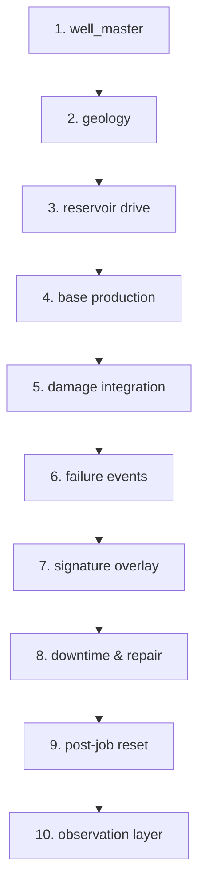

# 03 · Synthetic Data Specification

**Version:** 1.0 · **Date:** 2026-09-23
**Parent:** [00_overview.md](./00_overview.md) · **Consumed by:** Generator implementation, Validator

---

## 0. The answer, first

> **The central design problem for this synthetic dataset is managing the circularity of failure prediction. The generator must produce failures that are CAUSED BY the simulated covariates — otherwise the survival model correctly finds no signal and Act 3 collapses. However, if the failures are too cleanly caused by these covariates, the model recovers the generator's exact logic, resulting in an AUC > 0.95 (a data leak) which instantly destroys the demo's credibility. Resolving that tension via the injection of unobserved frailty is the core of this document.**

---

## 1. Generation pipeline

The synthetic dataset must be generated in a strict 10-stage sequence. Modifying this order will produce data that violates mass balance or time-causality.



| ID | Stage | Inputs | Outputs | Rule |
|---|---|---|---|---|
| **SD-001** | `well_master` | Distributions | Geometry, dates, lift config | 142 wells, Geleki field |
| **SD-002** | `geology` | `well_master` | Zone, perf intervals, contacts | Assigned per well |
| **SD-003** | `reservoir drive` | `geology` | Arps parameters | $b$, $D_i$ assigned |
| **SD-004** | `base production` | Arps params | Clean decline, no failures | Continuous production |
| **SD-005** | `damage integration` | `base production` | Cumulative $W(t)$ | Computes frailty-adjusted damage |
| **SD-006** | `failure events` | $W(t)$ | Event dates, taxonomy codes | Fires when $W(t) \ge W_{crit}$ |
| **SD-007** | `signature overlay` | Event dates | Modified pre-failure prod. | 14–45 day physics signatures |
| **SD-008** | `downtime & repair` | Event dates | `well_status_history` | Weibull/LogNormal + 8d floor |
| **SD-009** | `post-job reset` | `well_status_history`| Reset $W(t)$, updated Arps | Partial or full damage clear |
| **SD-010** | `observation layer`| Continuous prod. | `daily_production`, `well_tests`| 14-30d sampling, missingness |

---

## 2. Well population

The system requires `N_WELLS = 142` wells representing the Geleki field.

| ID | Attribute | Distribution / Assignment |
|---|---|---|
| **SD-011** | Spatial layout | Clustered (not uniform) around approx. 26.9°N, 94.5°E within the Geleki field boundary. |
| **SD-012** | Completion dates | Drawn between 1968-01-01 and 2015-12-31, skewed early (e.g., Beta(2, 5) scaled to the interval). |
| **SD-013** | Zone assignment | Categorical: Tipam (45%), Barail (35%), Lakadong (20%). |
| **SD-013b** | **Perforation depth — by zone** *(closes `D-17`)* | Drawn per zone, **truncated normal**, in metres MD: **Tipam** `N(2750, 180)` clipped to **[2400, 3100]** · **Barail** `N(3300, 250)` clipped to **[2900, 3700]** · **Lakadong/Therria** `N(3900, 280)` clipped to **[3500, 4377]**. `perf_bottom_m = perf_top_m + U(12, 60)`. See §2.2 for the grounding |
| **SD-013c** | **Total depth** | `total_depth_md_m = perf_bottom_m + U(15, 90)` (rathole). `total_depth_tvd_m = total_depth_md_m × (1 − U(0.005, 0.030))` — Geleki wells are near-vertical to modestly deviated; **the TVD/MD ratio must never exceed 1.0** |
| **SD-013d** | **Pump setting depth (SRP only)** | `pump_setting_depth_m = perf_top_m − U(30, 150)`, i.e. **the pump is set above the perforations, never below.** On `GAS_LIFT` and `NATURAL` wells this is `NULL`. This rule is what makes the `SD-014` constraint *(PSD > 2000 m ⇒ plunger ≤ 1.5 in)* actually bite |
| **SD-014** | SRP Geometry | Plunger diameter (1.25", 1.5", 1.75", 2.0"), Stroke length (54", 64", 74", 86", 100"). **Constraint:** Deeper pumps (PSD > 2000m) use smaller plungers (≤ 1.5"); longer strokes pair with lower SPM. |
| **SD-015** | **Lift Type — ASSUMED MIX, not observed** | `SRP` **70%** · `GAS_LIFT` **20%** · `NATURAL` (self-flowing) **10%**. **Every one of these three numbers is an assumption and must be labelled as such wherever it appears.** See §2.1 |
| **SD-015b** | **Fillage proxy gating** | `plunger_diameter_in`, `stroke_length_in` and `spm` are populated **only** where `lift_type = 'SRP'`. On `GAS_LIFT` and `NATURAL` wells they are `NULL`, and `TC-003` returns `UNAVAILABLE` (`DC-004`). **Model performance is reported on the SRP subset, never on all 142** |
| **SD-016** | Rod Grade | 'C' (20%), 'D' (50%), 'K' (30%). **SRP wells only**; `NULL` elsewhere |

### 2.1 Why "100% SRP" was dropped

> [!WARNING]
> **The original spec set `SD-015` to 100% SRP. That is contradicted, and it mattered because the pump fillage proxy (`MS-011`, `TC-003`) is the dominant mechanical feature in the model — and it is physically undefined on a gas-lifted or naturally flowing well.**

| Evidence | Source |
|---|---|
| A **23-well intermittent gas-lift optimisation campaign** in a mature Upper Assam field, using acoustic and downhole P/T surveys | SPE-194798-MS, Maut et al., **Oil India Ltd**, 2019 — *abstract-level only* |
| Geleki is served by **Gas Gathering Stations and gas compressor plants** | Secondary |
| ONGC Assam Asset tenders are titled *"Surface Installations **and Artificial Lift** Upkeep Services"* — plural lift types | Secondary |

**No public source gives a Geleki SRP / gas-lift / flowing split. None.** The 70/20/10 above is therefore a **modelling assumption chosen to be defensible, not a finding.**

| Rule | Statement |
|---|---|
| **SD-015c** | **The lift mix must be labelled *"assumed; actual mix to be supplied by Asset"* on any slide, report or agent response that depends on it.** Presenting it as observed is the same class of error as quoting an unsourced well count |
| **SD-015d** | **Obtaining the real split is a named deliverable input** from ONGC, listed in [02_data_contract.md](./02_data_contract.md) §12 alongside the other asks |
| **SD-015e** | **New evidence, and it cuts against us.** SPE-194798-MS (Maut et al., **Oil India Ltd**, 2019) reports **~48% of OIL's producing wells in Upper Assam are on gas lift**, driven by sand-prone, loosely consolidated Tipam sands. **OIL is not ONGC and Hapjan is not Geleki**, so this does not license changing the number. It does mean **20% gas lift is probably conservative**, and the agent must say so when asked |

> [!NOTE]
> **This is a stronger position than 100% SRP, not a weaker one.** A system that says *"the fillage proxy applies to 99 of your 142 wells, and here is what we use on the other 43"* is obviously built by someone who has thought about lift. A system that silently assumes every well is rod-pumped is not.

### 2.2 Where the depth numbers come from — `SD-013b`…`SD-013d`

> [!IMPORTANT]
> **`D-17`: the spec previously required `perf_top_m`, `perf_bottom_m`, `total_depth_md_m` and `total_depth_tvd_m` as `NOT NULL` in `well_master`, and specified no rule for generating any of them.** The implementer would have invented four depths. `SD-013b`…`SD-013d` close that.

| Anchor | Value | Source | Status |
|---|---|---|---|
| **Geleki TS-5A sand** | **2,700–3,100 m** | apgindia.org | 🟢 Grounded |
| **Geleki field-wide drilling range** | **2,400–4,000 m** | pcbassam.org | 🟢 Grounded |
| Tipam producers, working range | ≈ **2,400–3,100 m** | Derived from the two above | 🟢 Derived |
| Lakadong/Therria | 3,548–4,377 m | **Surfaced but could not be grounded to a URL** | 🟠 **Weak — treat the Lakadong band as illustrative** |
| Per-formation depths for TS-2, TS-3, TS-4, Barail, Kopili | — | **Not found in any public source** | 🔴 Not published |

**A prior claim of "3,000–4,200 m" for Geleki producers is refuted** and is recorded in [`research_appendix.md`](../research_appendix.md) §3.1. It would have put every Tipam well 300–1,100 m too deep, which in turn would have driven `SD-013d` to set pumps deeper than any Geleki pump actually sits, and pushed `SD-014` to the small-plunger branch for the entire field.

> **The Barail band is interpolated, not sourced.** It sits between the grounded Tipam range and the weakly-sourced Lakadong range because Barail lies stratigraphically between them. Label it as interpolated if asked.

---


## 3. The availability derivation — corrected 2026-09-23 (`D-15`)

> [!IMPORTANT]
> **This section previously claimed three sources reconciled to 0.2 percentage points. That claim was circular and has been withdrawn.** The corrected derivation is below. Canonical constants live in [`00_overview.md`](./00_overview.md) §5.2.

### 3.1 Inputs

*   `UPTIME_DIST` = `Weibull(β=2.0, η=216.7)` → $E[uptime] = 192.0$ days.
*   `DOWNTIME_DIST` = `LogNormal(μ=3.219, σ=1.142)`, **floored at 8 days.**
    *   Unfloored mean $= \exp(3.219 + 1.142^2/2) = 48.0$ days.
    *   **Floored mean $= 48.5$ days.** Computed numerically, not assumed.
    *   The floor exists because unfloored $p05 = 3.8$ days, which would imply workover rigs routinely mobilise in under four days.

### 3.2 The blend — actually applied this time

```
E[down | rig-requiring]   = 48.5 d      the floored mean
E[down | rigless]         =  2.0 d
RIGLESS_SHARE             =   24%       derived, 00 §5.3

E[down] blended = 0.76 × 48.5 + 0.24 × 2.0          = 37.3 d
FRACTION_DOWN_ACTIVE = 37.3 / (192.0 + 37.3)        = 16.3%
```

### 3.3 Two populations, not one — and this reverses a previous conclusion

```
PERMANENTLY_IDLE      =  4.5%    ⚠ FITTED to the census
FRACTION_DOWN_TOTAL   =  0.955 × 16.3% + 4.5%       = 20.0%
```

> [!WARNING]
> **The earlier version of this section argued that the population *could not* be split into active and permanently-idle. That argument was wrong, and it was wrong *because* of the `D-15` error.**
>
> It reasoned that at 5% idle, active wells would need $E[uptime] \approx 260$ days — implausible against a 5–9 month MTBF band. **But that figure was computed with the erroneous $E[down] = 48.7$ d.** At the correct **37.3 d**, a 4.5% idle carve-out needs $E[uptime] = 192.5$ d — **which is what we already have.**
>
> **The split closes at the observed MTBF. It was the arithmetic that was broken, not the two-population model.**

### 3.4 What corroborates and what is fitted — state the difference

| Check | Model | Reference | Status |
|---|---|---|---|
| **Downtime upper tail** | $p96.7 = 204.1$ d | **CAG-observed max 205 d** | 🟢 **Genuine independent corroboration.** `μ` and `σ` were set on other grounds; the tail landing here was not arranged |
| **Total down fraction** | 20.0% | Tamil Nadu census 20% | 🟠 **FITTED.** The 4.5% carve-out is a free parameter chosen to land here. **Legitimate calibration, but not agreement** |
| MTBF | 6.3 months | 5–9 month band | 🟢 Inside the band |

> **Say:** *"Our downtime distribution's upper tail independently reproduces the CAG-audited maximum of 205 days. The idle fraction is calibrated to the one published census we have."*
> **Do not say:** *"three independent sources reconcile to 0.2 percentage points."* **It was never true.**

### 3.5 Sensitivity — recomputed at `E[down] = 37.3 d`

| Weibull $\eta$ | $E[uptime]$ (d) | Down, active | Down, total *(incl. 4.5% idle)* |
|---|---|---|---|
| 188.0 | 166.6 | 18.3% | 22.0% |
| 200.0 | 177.2 | 17.4% | 21.1% |
| **216.7** | **192.0** | **16.3%** | **20.0%** |
| 240.0 | 212.7 | 14.9% | 18.7% |
| 270.0 | 239.3 | 13.5% | 17.4% |

> [!CAUTION]
> **`FRACTION_DOWN_TOTAL = 20.0%` is a target for the generator, not a guarantee from it.** The `SCALE_SAND` split moved sand to a rig job and scale to a bullheaded rigless job, so **the per-code downtime weights changed too.** The figure must come back out of `generator/validate.py`. **`DC-092` / `AT-092` assert 20.0% ± 1.0pp** — widened from ±0.5pp, because a tolerance tighter than the uncertainty in a fitted parameter is false precision.

---

## 4. Base production

| ID | Rule | Description |
|---|---|---|
| **SD-017** | Arps Decline | Fit to hyperbolic $q(t) = q_i / (1 + b D_i t)^{1/b}$. Parameter $b \in [0.5, 1.0]$, $D_i \in [0.05, 0.15]$ (annual). |
| **SD-018** | Water Cut | Must reach the working band of **60–92%**. |
| **SD-019** | Water Monotonicity | (`DC-091`) Water cut is monotonically non-decreasing on a 90-day rolling mean, *except* strictly across a water-shutoff job, where it drops. |
| **SD-020** | Observation Allocation | (`DC-016`) Production is `ALLOCATED` with 2-4% daily Gaussian noise, except on `well_tests` days (every 14-30 days) where it is `TESTED` (measured). |

---

## 5. The damage model

**THE CRITICAL SECTION:** To safely train a survival model that does not leak but still finds signal, failure times must be generated via a cumulative damage function combined with unobserved frailty.

Let $W(t)$ be the accumulated damage at time $t$:
$$W(t) = \int_0^t \left( c_1 \cdot Q_{fluid}(t) + c_2 \cdot \text{WC}(t)^2 \right) dt \times Z_i$$

Where:
*   $Q_{fluid}(t)$ is the total liquid rate.
*   $\text{WC}(t)$ is the water cut (driving corrosion/scale).
*   $c_1, c_2$ are mode-specific coefficients.
*   **$Z_i$ is the unobserved Frailty term** for well $i$.

A failure triggers when $W(t) \ge W_{crit}$.

**The Frailty Term ($Z_i$):**
$Z_i \sim \text{Gamma}(k, \theta)$ such that $E[Z_i] = 1.0$.
The model sees the rates, but *never* sees $Z_i$. This heterogeneity ensures that two wells with identical production profiles will fail at different times.

**Tuning Procedure for Concordance (C-index):**
The target C-index is the honest band of **0.65–0.72**.

> **Why the upper bound came down from 0.80.** This model sees **daily production data only — no dynamometer cards, no downhole gauges.** Published rod-pump survival work at that data grade does not reach 0.80, and every number above it that we found came from a **vendor performance claim, which this project rejects outright** ([`research_appendix.md`](../research_appendix.md) §3). **A demo that reports 0.68 and explains the ceiling is more credible in front of an ED than one that reports 0.85 and cannot.**

*   If C-index > 0.78 (data leak / too easy): **Increase frailty variance** by decreasing $k$ (e.g., $k=4.0 \rightarrow k=2.0$). **Treat this as a bug, not a win** — on this feature set it almost always means the generator leaked the failure date into a covariate.
*   If C-index < 0.62 (no signal): **Decrease frailty variance** by increasing $k$ (e.g., $k=10.0$).

---

## 6. Failure taxonomy

**Canonical source: [`00_overview.md`](./00_overview.md) §5.3.** This table must match it exactly. Shares must hold within $\pm 3\text{pp}$.

> **Classification is by the component that failed, not by the root cause.** Rod-on-tubing wear parts a rod → `ROD_PART`; the same wear holes the tubing → `TUBING_LEAK`.

### 6.1 SRP wells (`lift_type = 'SRP'`, 70% of the field)

| Code | Share | Primary Damage Driver | $W_{crit}$ scale | Downtime | Rigless? | Damage Reset ($W$) |
|---|---|---|---|---|---|---|
| `TUBING_LEAK` | **22%** | Corrosion (WaterCut$^2$) + rod-on-tubing wear | High | Rig | **No** | 100% reset |
| `ROD_PART` | **18%** | $Q_{fluid}$ + fillage cycles | Med | Rig | **No** | 100% reset |
| `WAX` | **15%** | Time + seasonal | Low | 1–3 d | **Yes** | 100% reset |
| `PUMP_WEAR` | **13%** | $Q_{fluid}$ + sand cut | High | Rig | **No** | 100% reset |
| `SURFACE` | **12%** | Pure time (random) | N/A | 1–2 d | **Yes** | N/A |
| `OTHER` | **8%** | Mixed / random | N/A | Mixed | Mixed | 50% reset |
| `SUDDEN_MECH` | **5%** | **Independent draw (no pre-cursor)** | N/A | Rig | **No** | 100% reset |
| `SAND` | **5%** | Sand production volume | Med | Rig *(cleanout below the pump)* | **No** | 80% reset |
| `SCALE` | **2%** | Water volume | Med | 2–5 d | **Yes** *(bullhead only)* | 80% reset |

**Sums to 100.** `PREDICTABLE_SHARE = 75%` — the unpredictable quarter is `SURFACE` 12 + `OTHER` 8 + `SUDDEN_MECH` 5.

> [!WARNING]
> **Three changes from the previous version of this table, and each one matters.**
> 1. `TUBING_LEAK` went **7% → 22%**. The old figure was off by 4–5× against published SRP bands of 30–45%.
> 2. `SCALE_SAND` (3%) was **split** into `SCALE` (2%) and `SAND` (5%). They have different damage drivers, different diagnostics, and — critically — **different rig requirements.** `SAND` requires a cleanout below the pump seating nipple and is therefore **`requires_rig = TRUE`** under `TC-008.6`. Carrying them as one code made a rig job look rigless.
> 3. `RIGLESS_SHARE` is now **24%**, derived from this table rather than asserted. The old 27% came from the old shares.

### 6.2 Gas-lift wells (`lift_type = 'GAS_LIFT'`, ~20% of the field) — `SD-028`

> [!CAUTION]
> **`D-16`: §6.1 is an SRP taxonomy.** `ROD_PART`, `PUMP_WEAR` and rod-on-tubing `TUBING_LEAK` together are **53% of it, and they are physically undefined on a well with no rod string.** Applying §6.1 to the 43 non-SRP wells would generate rod partings on wells that have no rods. `SD-028` closes that.

**There is no published share-of-failures distribution for gas-lifted wells.** Five independent searches found none. **Every share below is therefore assigned by us and must be labelled as assigned, not observed** — the same standing as `SD-015`.

| Mode | Assigned share | Physical driver | Rig? | Daily-data detectable? |
|---|---|---|---|---|
| **`GL_INJ_ANOMALY`** *(superclass — see below)* | **30%** | Valve erosion · bellows leak · multipointing · check-valve failure | **Rigless** — slickline valve change | 🟡 **Partly** — flags *"something is wrong with the injection system"*, cannot localise |
| **`GL_HEADING`** | **15%** | Casing heading / flow instability. Sub-critical flow across the valve couples casing and tubing hydraulics into a self-sustaining oscillation (Asheim / Alhanati criteria) | **Rigless** — choke or orifice change | 🟢 **YES — the clearest daily-data diagnosis in the whole taxonomy.** Rolling coefficient-of-variation on rate and THP |
| **`GL_LOADING`** | **12%** | Liquid loading. Gas velocity falls below carry-over; aggravated by high water cut | **Rigless** — increase injection, deepen injection point, velocity string | 🟢 **YES** — rising THP with falling total rate |
| **`WAX`** | **15%** | Same as §6.1. **Dominant flow-assurance risk in Upper Assam** — 11–25 wt% wax, 25–33 °C pour point | Rigless (scrape / hot oil) | 🟢 Pattern yes, cause no |
| **`TUBING_LEAK`** | **10%** | Corrosion, connection failure, or a failed GLV creating tubing–annulus communication | **RIG** | 🟡 Partly — CHP and THP converge |
| **`SAND`** | **8%** | Unconsolidated Tipam sand fills rathole and perforations | **RIG** | 🔴 **No** — looks like generic productivity loss |
| **`SURFACE`** | **6%** | Wellhead, flowline, surface controls | Rigless | 🟢 Yes |
| **`SCALE`** | **2%** | Mineral scale in tubing or GLV orifice | Rigless (bullhead) | 🟡 Partly |
| **`OTHER`** | **2%** | Residual | Mixed | Mixed |

**Sums to 100.**

| Rule | Statement |
|---|---|
| **SD-028** | Gas-lift wells draw their failure mode from §6.2, **never** from §6.1. `ROD_PART` and `PUMP_WEAR` must not appear on any well where `lift_type ≠ 'SRP'`. **Enforced as a hard generator assertion, not a convention** |
| **SD-029** | **Collapse, do not pretend to discriminate.** Valve erosion, bellows leak, multipointing and check-valve failure all produce a recognisable CHP / gas-rate disturbance and are **mutually confusable on daily data**. They are therefore generated and reported as the single superclass `GL_INJ_ANOMALY`. **Separating them requires an acoustic or slickline P/T survey, and the agent must say so.** Claiming daily-data discrimination between a bellows leak and valve erosion would not survive one question from a production engineer |
| **SD-030** | **Valve chatter is deliberately excluded.** It is a seconds-to-minutes phenomenon; a daily average washes it out entirely. Generating it would create a label no model could ever learn |
| **SD-031** | **Compressor / injection-supply failure is a FIELD event, not a well event.** It must be generated as a **correlated shock across all gas-lift wells on the same GGS simultaneously** — CHP collapses field-wide, oil declines together, both recover on restart. It is **excluded from `well_status_history` failure labels** because no well failed. **This is the first filter the agent applies**, and getting it wrong means reporting one compressor trip as fourteen well failures |
| **SD-032** | **Naturally flowing wells (`NATURAL`, ~10%)** draw from `WAX` 35% · `SAND` 25% · `SCALE` 10% · `SURFACE` 20% · `OTHER` 10%. **No lift equipment means no lift-equipment failures.** Assigned, not observed |

> [!NOTE]
> **`SD-031` is the quiet win.** A field-wide correlated CHP drop is trivially detectable and unambiguous — and it is exactly the event that a naive per-well trigger reports as a mass failure. Being the system that says *"this is your compressor, not your wells"* is worth more in the room than any ranking.


---

## 7. Pre-failure signatures

The dataset must explicitly inject these signatures into the 14–45 day window preceding a triggered failure event. The functional form includes the base rate plus a magnitude modifier and Gaussian noise ($\sigma$).

| ID | Mode | Signature Behaviour | Mathematical Overlay (14-45d window) |
|---|---|---|---|
| **SD-021** | Pump wear | Liquid gradual decline, CHP rises, THP flat. | $Q_{liq} = Q_{base} \cdot (1 - 0.3 \cdot (t/45))$, $CHP = CHP_{base} + \Delta 10 \cdot (t/45)^2$ |
| **SD-022** | Tubing leak | Liquid sharp drop over 3-5d, CHP flat, THP flat. | $Q_{liq}$ drops 60% over a 4-day sigmoid exactly prior to failure. |
| **SD-023** | Wax | Liquid drops, CHP flat, THP rises, seasonal. | $THP = THP_{base} \cdot (1 + 0.4 \cdot (t/30))$. Modulate probability higher in Nov-Feb. |
| **SD-024** | Scale | Liquid flat until failure, CHP/THP flat. | No rate warning. Constant until binary shut-in. |
| **SD-025** | Rod part | Liquid $\rightarrow 0$ instantly, CHP flat, THP drops. | Instantaneous drop to 0 at failure day. |
| **SD-026** | Gas inter. | Erratic liquid, CHP rises, THP flat, GOR rises. | $Q_{liq}$ gets $\times 3$ variance noise. $GOR = GOR_{base} \cdot (1 + 0.5 \cdot (t/30))$. |

### 7.1 Gas-lift signatures — `SD-033`

Required so that the 43 non-SRP wells carry learnable pre-failure signal rather than bare labels.

| ID | Mode | Signature Behaviour | Mathematical Overlay |
|---|---|---|---|
| **SD-033a** | `GL_INJ_ANOMALY` | Injection gas rises for the same or less oil. CHP drifts. **Efficiency degrades before rate does.** | $Q_{gas,inj} = Q_{base} \cdot (1 + 0.35 \cdot (t/30))$ while $Q_{oil}$ is flat to −10%. **The learnable feature is the ratio $Q_{gas,inj}/Q_{oil}$, not either alone** |
| **SD-033b** | `GL_HEADING` | **Variance, not level.** Large day-to-day swings in oil, gas and THP with no operational cause; cyclic CHP | Multiply daily $\sigma$ on $Q_{oil}$ and $THP$ by a factor ramping $1 \rightarrow 4$ over 30 d. **The level trend stays flat** — a model keying on rate alone must miss this, and a model keying on rolling CV must catch it |
| **SD-033c** | `GL_LOADING` | **Rising THP with falling total rate** — the classic loading pair | $THP = THP_{base} \cdot (1 + 0.5 \cdot (t/30))$, $Q_{liq} = Q_{base} \cdot (1 - 0.4 \cdot (t/30))$, plus intermittent zero-production days at increasing frequency |
| **SD-033d** | **Compressor event** *(`SD-031`, not a failure)* | **Correlated across every gas-lift well on the GGS on the same day.** CHP collapses, oil drops, both recover | Step: $CHP \rightarrow 0.15 \cdot CHP_{base}$ and $Q_{oil} \rightarrow 0.2 \cdot Q_{base}$ for 1–4 days, **identical dates across the cohort**, then full recovery. **No `well_status_history` failure row is written** |

> [!IMPORTANT]
> **`SD-033d` is a deliberate trap laid for our own system.** If the ranking engine puts fourteen wells on the priority list the morning after a compressor trip, the demo fails in front of an engineer who recognises it instantly. **`AT`-level coverage for this case is mandatory** — see [`08_test_plan.md`](./08_test_plan.md).

---

## 8. Water mechanism generation

The Chan sign convention from `00_overview` §6 is **NORMATIVE AND MUST NOT BE INVERTED**.

| Mechanism | Chan Classification | Generating Process (WOR as function of time) |
|---|---|---|
| **Coning** | WOR' slope **NEGATIVE** | $WOR(t) = WOR_{max} - A \cdot t^{-k}$ for $k \in [0.3, 0.7]$. It is self-limiting and decelerates. |
| **Channelling** | WOR' slope **POSITIVE** | $WOR(t) = A \cdot t^n$ for $n \in [1.0, 1.2]$. It is progressive and accelerates. |
| **Multilayer** | WOR' **PLATEAU** | $WOR(t) = c \cdot \ln(t) + d$. The derivative is constant. |
| **Injector breakthrough** | WOR' slope **POSITIVE** — *a channelling signature, but a different job* | $WOR(t) = A \cdot t^n$, $n \in [1.0, 1.3]$, **onset correlated with a step increase in the paired injector's rate 20–70 days earlier** |

**SD-027:** The generator must inject these specific mathematical forms into the water cut profiles so that a correct Chan implementation acting on the data accurately recovers the right label.

### 8.1 Injector breakthrough — `SD-034`

> [!WARNING]
> **Chan cannot separate injector breakthrough from formation channelling. They produce the same positive WOR′ slope.** But they call for **different interventions on different equipment**: channelling gets a cement squeeze on the *producer*; injector breakthrough is often better fixed by **reallocating injection at the injector**, which is cheaper, rigless, and does not touch the producer at all. **Recommending a cement squeeze on a well whose real problem is an over-injecting neighbour is an expensive, visible, and entirely avoidable error.**

| Rule | Statement |
|---|---|
| **SD-034** | **Generate an injector–producer pairing.** Geleki is under water injection. Each producer is assigned 0–3 nearest injectors within a radius drawn from `well_offsets`, with a **lag distribution of 20–70 days** between an injection-rate step and the producer's WOR response |
| **SD-035** | **Of the wells generated with a positive WOR′ slope, ~35% are injector breakthrough and ~65% are formation channelling.** Assigned, not observed — **label it** |
| **SD-036** | **The discriminating feature is not in the producer's own data.** It is `paired_injector_rate_change_lagged` — the 20–70 day lagged step in the paired injector's rate. **A model that only ever looks at one well cannot form this feature**, which is exactly why it is worth building |
| **SD-037** | **When the pairing feature is absent or ambiguous, the diagnosis is `CHANNELLING_OR_INJECTOR_BREAKTHROUGH` and the recommendation is a tracer or injection survey — not a squeeze.** Refusing to pick between two jobs on insufficient evidence is the behaviour this whole system is supposed to demonstrate |

> **This is a genuine differentiator and it costs one join.** Every single-well analytics product on the market is structurally incapable of it, because they look at one well at a time.


---

## 9. The validator

Run on every regeneration.

1.  **Mass Balance (`DC-090`):** `SUM(daily_production.oil)` over an episode matches integrated Arps $\pm 2\%$.
2.  **Water Monotonicity (`DC-091`):** WC non-decreasing on 90d mean except at WSO jobs.
3.  **Triangle Check (`DC-092`):** `FRACTION_DOWN` = $20.2\% \pm 0.5\text{pp}$.
4.  **Taxonomy Shares (`DC-093`):** Failure codes match §6 within $\pm 3\text{pp}$.
5.  **No Zeros While Flowing (`DC-095`):** Rate is never `0` when `is_producing = TRUE` (must be `NULL` if down).
6.  **`SD-040` Discriminability Test:** Train a 6-class Random Forest on the `[t-30, t]` window features.
    *   **Pass:** Macro-F1 $\in [0.70, 0.85]$.
    *   **Fail:** $< 0.60$ (signatures inseparable) or $> 0.95$ (signatures cartoonish/leaking).

---

## 10. Deliberate imperfections

A perfect dataset is instantly dismissed by engineers.

| ID | Imperfection | Requirement | Reason |
|---|---|---|---|
| **SD-051** | Suspect Tests | ~5% of `well_tests` marked `SUSPECT`. | Operational reality. |
| **SD-052** | Rejected Tests | ~2% of `well_tests` marked `REJECTED`. | To prove `DC-021` exclusion logic works. |
| **SD-053** | False Positives | Inject 3-4 instances where Trigger A fires due to a choke change that is *missing* from the data feed. | Required for the monthly ED scorecard's "Where the system was wrong" section. |
| **SD-054** | Unpredictable | $\ge 2$ failures with absolutely no detectable precursor (the 5% `SUDDEN_MECH` class). | Real machines break without warning. Model must miss them. |
| **SD-055** | Right Censoring | ~40% of the most recent episodes are `is_censored = TRUE`. | A dataset without censoring has been artificially truncated. |
| **SD-056** | Job Failures | Overall job success rate must be 60-70%. | 100% success is not credible in mature assets. |

---

## 11. Reproducibility

| ID | Rule | Description |
|---|---|---|
| **SD-061** | Seed Management | A single global integer `RANDOM_SEED` dictates all `numpy` and `scipy` PRNG states. |
| **SD-062** | Package Pinning | `uv` and `pyproject.toml` strictly pin all dependency versions. |
| **SD-063** | Byte-Identical | (`NFR-003`) Rerunning the generator with the same seed on the same git hash produces byte-identical output files. |

---

## 12. Specific fixtures the demo requires

The generator must deterministically construct these 7 wells with specific trajectories to support Act 3.

> [!CAUTION]
> **Every fixture below has been checked against `TC-008.6`, the rig/rigless invariant.** On an SRP well nothing enters the wellbore below the pump seating nipple without first pulling the rod string. Two fixtures were wrong on exactly this point and are corrected here — see §12.1. **The rigless share is a commercial claim in the pitch; a fixture that inflates it is a defect, not a simplification.**

| Well | Required Status / Trajectory | Job | Rig? | Demo Purpose |
|---|---|---|---|---|
| **GK-129** | Channelling (WOR′ **+1.08**), WC 62% → 78% in 11 days. Stable offsets. Requires a 1998 poor cement-bond report and a 2019 **failed** WSO (survived 14 months). Currently 18 BOPD. | Cement squeeze + re-perforation | **RIG**, 5–10 d | The deep-dive well. Justifies the dearer job over the straddle packer that already failed here |
| **GK-141** | Trigger A fires (22% below own decline) **BUT offsets are proportionally down too** | `NO JOB JUSTIFIED` | — | The refusal. Reservoir decline, not a wellbore problem |
| **GK-103** | Coning (WOR′ **negative** slope) | Choke adjustment | **RIGLESS**, <1 d | Surface-only work. The cheap contrast to GK-129, and the Chan sign convention made visible |
| **GK-112** | Scale (38% below own decline), no rate precursor until the step | Acid treatment, **bullheaded** | **RIGLESS**, 1–2 d | Annulus-accessible chemical treatment. Genuinely rigless |
| **GK-087** | Trigger B only — 6.4 months against its **own** p50 of 5.9 | Rod string + guides (fluid pound → rod fatigue) | **RIG** (pulling unit), 2 d | The purely time-based trigger, with no rate signal at all |
| **GK-055** | Pump wear — fillage divergence **and** CHP rise | Pump changeout | **RIG** (pulling unit) | The mechanical diagnosis. **The insert pump comes out on the rod string** |
| **GK-147** | Wax — THP rising, seasonal (Nov–Feb weighted) | Hot oil + solvent soak, circulated down the annulus | **RIGLESS**, 1–2 d | Seasonal mechanism, annulus-accessible treatment |

**Resulting mix: 3 rigless of 7.** That is deliberately richer than the 24% asset-wide share, because Act 3 must show the rigless queue exists. **The narration must say so** rather than implying the field average is 43%.

### 12.1 Two fixtures that were wrong

| Fixture | Was | Why it was wrong | Now |
|---|---|---|---|
| **GK-055** | *"Rigless slickline pump changeout"* | An insert pump on a rod-pumped well is retrieved **with the rod string**. Slickline cannot pull rods. There is no rigless path to the pump | Pulling unit, `requires_rig = TRUE` |
| **GK-147** | *"Hot oil + scraping"* | Hot oiling down the annulus is genuinely rigless. **Mechanical scraping is not** — a wireline scraper cannot pass the rod string. Rod scrapers exist, but they are fitted *while the rods are out*, which means the rods have already been pulled | Hot oil + solvent soak, both annulus-circulated |

> [!NOTE]
> **`SD-014` sets 100% SRP, which is what makes this invariant bite on every fixture.** If the artificial-lift mix at Geleki turns out to include self-flowing or gas-lifted wells, the rigless options widen considerably and these fixtures should be revisited — the constraint is a property of rod pumps, not of the field.
